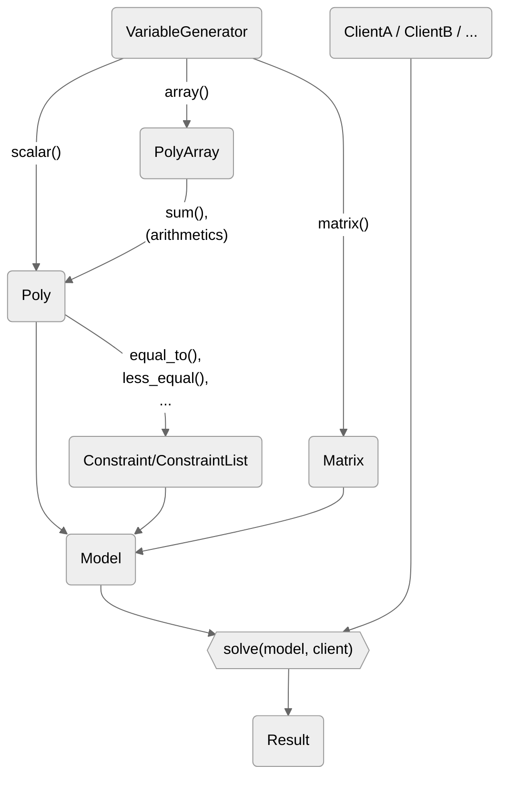

---
title: "Quantum Open Development Ecosystem (QODE)\n
 Optimization Division\n
 Specification Document"
author: "Q-STAR\n(Quantum STrategic industry Alliance for Revolution)"
date: "May 29, 2025"
toc: true
filters:
 -diagram
---

# Overview {#overview}
This document describes an interface specification of a software development kit, hereinafter referred to as “the SDK,” which is designed to solve a wide variety of combinatorial optimization problems.  
This SDK is part of a software ecosystem designed to uniformly handle quantum computers including quantum annealing machines and quantum gate computers, shown in Fig. 1\. 1\. While its primary application currently targets mathematical optimization problems, it is expected to encompass quantum chemistry calculations and other applications in the future.

![][image1]

Fig 1.1  A schematic ecosystem for quantum computing

The specification will cover the following items.

* Assumed system architecture  
* Process of creating (formulating) a model and obtaining a solution  
* Specification of arguments and return values of functions and classes required for formulation  
* Specifications of processing performed by functions and class methods

On the other hand, the specification will NOT cover the following items.

* Algorithms and hardware specifications for calculations  
* Non-Python library specifications

The SDK assumes Python as its runtime environment. Therefore, although attributes are described in the documentation, it is acceptable to implement them as properties.

# System architecture and optimization steps {#system-architecture-and-optimization-steps}

This specification assumes the following system architecture, shown in Fig. 1.2.

Fig 1.2  A schematic system architecture assumed in this specification.



The SDK MUST be able to perform optimization by formulating a combinatorial optimization problem using the following steps:

### (1)Create decision variables {.unnumbered}

   First, create a generator (**VariableGenerator**) that creates decision variables. Next, create a variable (**Poly**) or an array of variables (**PolyArray**) using the **VariableGenerator**.

### (2) Create objective function {.unnumbered}

   Define the objective function (**Poly**) using the variables generated by the **VariableGenerator**.

### (3) Construct constraints  {.unnumbered}

   Construct constraints (**Constraint**) from polynomials using constraint creation functions. If multiple constraints are needed, combine them into a constraint list (**ConstraintList**).

### (4) Formulate optimization model  {.unnumbered}

   Create the optimization model (**Model**) from the objective function and constraints.

### (5) Specify solver client attributes  {.unnumbered}

   Specify a machine or solver to use and create a solver client.

### (6) Execute solver  {.unnumbered}

   Pass the optimization model and solver client, and run the optimization through the solve function. The result of the execution is returned as **Result**, and the objective function value and the variables of the optimal solution can be obtained.

# Decision Variables {#decision-variables}

   The SDK MUST support the following classes and methods to determine the decision variables.

## Variable Generator {#variable-generator}

The **VariableGenerator** class generates decision variables. This class MUST support the following methods.  

| Method | Return type | Description |
| :---- | :---- | :---- |
| scalar() | **Poly** | Create a single variable |
| array() | **PolyArray** | Create multiple variables |

## Methods and Arguments {#methods-and-arguments}

The above methods MUST support the following types of decision variables as arguments.  

| Argument | Type | Variable type | Description |
| :---- | :---- | :---- | :---- |
| variable\_type | string | “Binary” | A variable taking the value 0 or 1 |
|  |  | “Ising” | A variable taking the value \-1 or 1 |
|  |  | “Integer” | A variable taking an integer value |
|  |  | “Real” | A variable taking a real value |

The above methods MUST also support the following arguments.

| Argument | Type | Description |
| :---- | :---- | :---- |
| name | string | Specify the name of the variables |
| bounds | tuple(number, number) | \[Integer or real variable only\] Specify the range of possible values |

### scalar() {#scalar}

Define the **scalar()** method that creates a single variable. The variable MUST be returned as an instance of the **Poly** class, which represents the polynomial of the variable.

### array() {#array}

Define the **array()** method that creates multiple variables at once. An array of variables (NumPy-like multidimensional array format) MUST be returned as an instance of the **PolyArray** class, which represents the polynomial array of the variable. This method MUST support the following argument to specify the shape of the array.  

| Argument | Type | Description |
| :---- | :---- | :---- |
| shape | int | tuple\[int, …\] | Specify the shape of the array |

Once the new variables are created, the names MUST be automatically appended with a string representing the array index. The elements and slices MUST be retrievable in the same way as a Python list or NumPy array. The lower and upper bounds for variables MUST be specified collectively at the time of creation.

## Get variable information {#get-variable-information}

Define the **as\_variable()** method that gets information about generated variables. The following information MUST be supported by this method.  

| Attribute | Type | Description |
| :---- | :---- | :---- |
| name | string | Variable name |
| id | int | Variable ID number An integer value assigned starting from 0 in order of issuance |
| type | **VariableType** | Variable type |
| lower\_bound | float | \[Integer or real variable only\] Variable lower bound *None* means \-$\infty$ |
| upper\_bound | float | \[Integer or real variable only\] Variable upper bound *None* means \+$\infty$ |

The information about variables issued by the **VariableGenerator** class MUST be retrievable by using the **variables** attribute. The names, lower bounds, and upper bounds of variables MUST be modifiable later.

## Example code {#example-code}

In the example code, the library name is represented as "SDK," but you should replace it with the actual library name as appropriate. The same applies to the following example codes.  

```python
from SDK import VariableGenerator

gen = VariableGenerator()
q = gen.scalar("Binary")				# print(q) -> q_0
i = gen.scalar("Ising", name="is")		# print(i) -> is
r = gen.scalar("Real", bounds=(2.0, 3.0))	# 2.0 <= r <= 3.0

q_arr = gen.array("Integer", 3, bounds=(1, 3))
"""
print(q_arr) -> [q_0, q_1, q_2]
print(q_arr[0]) -> q_0
print(q_arr[:2]) -> [q_0, q_1]
"""
q_mlt_arr = gen.array("Binary", shape=(2, 3))
"""
print(q_mlt_arr) -> 
[[q_{0,0}, q_{0,1}, q_{0,2}],
   [q_{1,0}, q_{1,1}, q_{1,2}]]
print(q_mlt_arr[0, 0]) -> q_{0,0}
print(q_mlt_arr[0, :]) -> [q_{0,0}, q_{0,1}, q_{0,2}]
"""

# print(q.as_variable()) -> {name: q_0, id: 0, type: Binary}
vars = gen.variables
"""
print(vars) ->
[Variable({name: q_0, id: 0, type: Binary}),
 Variable({name: is, id: 1, type: Ising}),
 Variable({name: r_0, id: 2, type: Real, lower_bound: 2, upper_bound: 3})]
"""

vars[2].name = "r"
vars[2].lower_bound = 0.0
"""
print(vars[2]) ->
{name: r, id: 2, type: Real, lower_bound: 0, upper_bound: 3}
"""
```

# Polynomials {#polynomials}

   The SDK MUST support the following classes and methods to determine the polynomials. The SDK MUST be able to use the polynomial created as an objective function of a combinatorial optimization problem without modification.

## Arithmetic of polynomial {#arithmetic-of-polynomial}

The SDK MUST support the creation of polynomial expressions by performing quadrature operations and exponentiation on variables created by **VariableGenerator**. It MUST be able to include variables from different arrays or of different types within the same polynomial, provided they were all created by the same **VariableGenerator**.  
      The SDK MUST also support the following logical operators.  

| Operator | Effect |
| :---- | :---- |
| & (logical AND) | x & y is equivalent to x \* y. |
| | (logical OR) | x | y is equivalent to \-x \* y \+ x \+ y. |
| ^ (exclusive OR) | x ^ y is equivalent to \-2 \* x \* y \+ x \+ y. |

## Arithmetic of polynomial arrays {#arithmetic-of-polynomial-arrays}

The SDK MUST provide the **sum()** method that creates polynomial expressions from **PolyArray**. **PolyArray** MUST also be able to perform quadratic operations with numbers and NumPy arrays.  

| Method | Argument | Return type | Description |
| :---- | :---- | :---- | :---- |
| sum() | axis \= None | int | tuple\[int, …\] | **Poly** | **PolyArray** | Calculate the sum of variables |

## Attributes and methods of polynomial {#attributes-and-methods-of-polynomial}

   Polynomial class **Poly** MUST support the following methods and attributes to get and change information about polynomials.

| Method / Attribute | Return type | Description |
| :---- | :---- | :---- |
| degree() | int | Degree of the polynomial |
| is\_number() / is\_linear() / is\_quadratic() | bool | Whether the polynomial is below a certain degree |
| is\_variable() | bool | Whether the polynomial can be considered a single variable i.e. a one-dimensional monomial with coefficient 1 |
| variables | list\[**Variables**\] | Information about all variables in the polynomial |
| substitute() | **Poly** | The result of assigning numbers or other polynomials to variables of a polynomial expression |

## Example code {#example-code-1}

```python
from SDK import VariableGenerator
import numpy as np

gen = VariableGenerator()
q = gen.array("Binary", 6)
p = -q[0] + 2.3 * q[1] * q[2] - (q[3] + q[4]) ** 2 * q[5]
# print(p) -> - 2 q_3 q_4 q_5 + 2.3 q_1 q_2 - q_3 q_5 - q_4 q_5 - q_0

q = gen.array("Binary", 3)
s = gen.array("Ising", 2)
n = gen.scalar("Integer", bounds=(-1, 2))
p = q[0] + s[1] - 2 * n
# print(p) -> q_0 + s_1 - 2 n_0

q = gen.array("Binary", shape=(3, 3))
"""
print(q.sum()) -> q_{0,0} + q_{0,1} + q_{0,2} + q_{1,0} + q_{1,1} + q_{1,2} + q_{2,0} + q_{2,1} + q_{2,2}
print(q.sum(axis=1)) ->
   [q_{0,0} + q_{0,1} + q_{0,2},
    q_{1,0} + q_{1,1} + q_{1,2},
    q_{2,0} + q_{2,1} + q_{2,2}]
print(q.sum(axis=0)) ->
   [q_{0,0} + q_{1,0} + q_{2,0},
 q_{0,1} + q_{1,1} + q_{2,1},
 q_{0,2} + q_{1,2} + q_{2,2}]
print(2 * q) -> 
   [[2 q_{0,0}, 2 q_{0,1}, 2 q_{0,2}],
 [2 q_{1,0}, 2 q_{1,1}, 2 q_{1,2}],
 [2 q_{2,0}, 2 q_{2,1}, 2 q_{2,2}]]
"""

a = np.array([[1,2,3],[4,5,6],[7,8,9]])
"""
print(q * a) -> 
   [[  q_{0,0}, 2 q_{0,1}, 3 q_{0,2}],
 [4 q_{1,0}, 5 q_{1,1}, 6 q_{1,2}],
 [7 q_{2,0}, 8 q_{2,1}, 9 q_{2,2}]]
"""
q = gen.array("Binary", 4)
p = q[0] * q[1]
"""
p.degree() -> 2
p.is_number() -> False
p.is_linear() -> False
p.is_quadratic() -> True

q[0].is_variable() -> True
(q[0] + 1).is_variable() -> True
(2 * q[0]).is_variable() -> False

(q[0] + 2 * q[1]).variables -> 
   [Variable({name: q_0, id: 0, type: Binary}),
 Variable({name: q_1, id: 1, type: Binary})]
"""
p = q[0] + q[1]
"""
print((q[0] + q[1]).substitute({q[0]: 1, q[1]: 0})) -> 1
print((q[0] + q[1]).substitute({q[0]: 1})) -> q_1 + 1
print((q[0] + q[1]).substitute({q[1]: q[2] * q[3]})) -> q_2 q_3 + q_0

print(q.substitute({q[0]: 1, q[1]: 0})) -> [  1,   0, q_2, q_3]
print(q.substitute({q[1]: q[2] * q[3]})) -> [  q_0, q_2 q_3,  q_2,  q_3]
"""
```

# Constraints {#constraints}

   The SDK MUST support setting constraints on the range of possible values for each variable, as well as constraints on the range of possible values for polynomial expressions. The SDK MUST support the following classes, methods, and operations for setting constraints on decision variables and for constructing constraint objects using polynomials.

## Fix values {#fix-values}

The SDK MUST support fixing the values of decision variables, by replacing part of the variable array with numeric values in advance. The SDK MUST also support imposing a constraint where a polynomial with another variable represents a variable by replacing part of the variable array with a polynomial.

## Limit the range of variable values {#limit-the-range-of-variable-values}

See chapter [Methods and Arguments](#methods-and-arguments)

## Limit the range of polynomial values {#limit-the-range-of-polynomial-values}

The SDK MUST manage equality, inequality, and other expressions representing constraints on the range of possible polynomial values as constraint objects of the **Constraint** class.

### Equality constraints {#equality-constraints}

The SDK MUST support the following helper functions to create constraint objects that represent equalities. The SDK MUST support assigning labels to these constraints.  

| Helper function | Arguments | Description |
| :---- | :---- | :---- |
| equal\_to() | **Poly** | **PolyArray**, float | Constrains the polynomial to be equal to the right-hand side |
| one\_hot() | **Poly** | **PolyArray** | Constrains the polynomial to be equal to 1 |

### Inequality constraints {#inequality-constraints}

The SDK MUST support the following helper functions to create constraint objects representing inequalities. The SDK MUST support assigning labels to these constraints.  

| Helper function | Arguments | Description |
| :---- | :---- | :---- |
| less\_equal() | **Poly** | **PolyArray**, float | Constrains a polynomial to be less than or equal to the right-hand side |
| greater\_equal() | **Poly** | **PolyArray**, float | Constrains a polynomial to be greater than or equal to the right-hand side |
| clamp() | **Poly** | **PolyArray**, tuple\[float, float\] | Constrains the polynomial to be in a range between |

### Constraint list {#constraint-list}

The SDK MUST support the handling of multiple constraints as a **ConstraintList**. The SDK MUST also support an empty **ConstraintList** object. A **ConstraintList** object MUST be generated by adding **Constraint** objects together. **ConstraintList** MUST also support adding a **Constraint** object using the \+ or \+= operator.  

### Constraint weights {#constraint-weights}

Multiplying a **Constraint** object by a number MUST multiply its weight. Multiplication by numbers for **weight** MUST also be defined for **ConstraintList** objects. **Constraint** MUST support the **weight** attribute to obtain and set the weight of a constraint object. The default value of **weight** MUST be 1\.

## Example code {#example-code-2}

```python
from SDK import VariableGenerator, equal_to, one_hot, less_equal, greater_equal, clamp

gen = VariableGenerator()
q = gen.array("Binary", shape=(3, 3))

q[0, :] = 0
q[:, 0] = 0
q[0, 0] = 1
"""
print(q) -> 
   [[      1,       0,       0],
 [      0, q_{1,1}, q_{1,2}],
 [      0, q_{2,1}, q_{2,2}]]
"""
p = q.sum()	# print(p) -> q_{1,1} + q_{1,2} + q_{2,1} + q_{2,2} + 1
q[2, 2] = q[1, 1]
"""
print(q) -> 
   [[      1,       0,       0],
 [      0, q_{1,1}, q_{1,2}],
 [      0, q_{2,1}, q_{1,1}]]
"""

q = gen.array("Binary", shape=(3, 3))
c = equal_to(q[0, 0] + q[1, 1] + q[2, 2], 1)
# print(c) -> q_{0,0} + q_{1,1} + q_{2,2} == 1 (weight: 1)
c = equal_to(q[0, 0] + q[1, 1] + q[2, 2], 1, label="diagonal sum")
# print(c) -> diagonal sum: q_{0,0} + q_{1,1} + q_{2,2} == 1 (weight: 1)

c = equal_to(q[0], 1, label="1st row sum")
# print(c) -> 1st row sum: q_{0,0} + q_{0,1} + q_{0,2} == 1 (weight: 1)

c = one_hot(q[0], label="1st row one-hot")
# print(c) -> 1st row one-hot: q_{0,0} + q_{0,1} + q_{0,2} == 1 (weight: 1)

c_le = less_equal(q[0], 2)
c_ge = greater_equal(q[0], 2)
c_bw = clamp(q[0], (1, 2))
"""
print(c_le) -> q_{0,0} + q_{0,1} + q_{0,2} <= 2 (weight: 1)
print(c_ge) -> q_{0,0} + q_{0,1} + q_{0,2} >= 2 (weight: 1)
print(c_bw) -> 1 <= q_{0,0} + q_{0,1} + q_{0,2} <= 2 (weight: 1)
"""

q = gen.array("Binary", shape=(3, 3))
c0 = equal_to(q[0], 1)
c1 = equal_to(q[1], 1)
clist = c0 + c1
"""
print(clist) -> 
   [q_{0,0} + q_{0,1} + q_{0,2} == 1 (weight: 1),
    q_{1,0} + q_{1,1} + q_{1,2} == 1 (weight: 1)]
"""
clist += equal_to(q[2], 1)
"""
print(clist) -> 
   [q_{0,0} + q_{0,1} + q_{0,2} == 1 (weight: 1),
 q_{1,0} + q_{1,1} + q_{1,2} == 1 (weight: 1),
 q_{2,0} + q_{2,1} + q_{2,2} == 1 (weight: 1)]
"""

q = gen.array("Binary", shape=(3, 3))
c = equal_to(q[0, 0] + q[1, 1] + q[2, 2], 1)	# print(c.weight) -> 1.0
c.weight = 3		# print(c.weight) -> 3.0
c.weight *= 2		# print(c.weight) -> 6.0

c1 = equal_to(q[0], 1)
c2 = equal_to(q[1], 1)
clist = c1 + c2
"""
print(clist) ->
[q_{0,0} + q_{0,1} + q_{0,2} == 1 (weight: 1),
 q_{1,0} + q_{1,1} + q_{1,2} == 1 (weight: 1)]
"""

clist *= 2
"""
print(clist) ->
[q_{0,0} + q_{0,1} + q_{0,2} == 1 (weight: 2),
 q_{1,0} + q_{1,1} + q_{1,2} == 1 (weight: 2)]
"""
```

# Model {#model}

   The SDK MUST support the following classes, methods, and operations to formulate the combinatorial optimization problem using decision variables, objective functions, and constraints.

## Model class {#model-class}

The SDK MUST represent combinatorial optimization problems as instances of the **Model** class. The **Model** class constructor MUST accept **Poly** or/and **Constraint / ConstraintList** as arguments to represent the problem. **Model** objects MUST also be generated by adding **Poly** and **Constraint / ConstraintList**. 

## Model attributes {#model-attributes}

The **Model** class MUST provide the following attributes.  

| Attribute | Type | Description |
| :---- | :---- | :---- |
| objective | **Poly** | The objective function of the model |
| constraints | **ConstraintList** | Constraints of the model |

## Example code {#example-code-3}

```python
from SDK import VariableGenerator, Model, equal_to, one_hot

gen = VariableGenerator()
q = gen.array("Binary", shape=(2, 3))

objective = q[0, 0] * q[0, 1] - q[0, 2]
constraint1 = equal_to(q[0, 0] + q[0, 1] - q[0, 2], 0)
constraint2 = one_hot(q[1, :])
constraint_list = constraint1 + constraint2

model = objective + constraint1
"""
print(model) -> 
minimize:
     q_{0,0} q_{0,1} - q_{0,2}
subject to:
  q_{0,0} + q_{0,1} - q_{0,2} == 0 (weight: 1)
"""
model = objective + constraint_list
"""
print(model) -> 
minimize:
     q_{0,0} q_{0,1} - q_{0,2}
subject to:
  q_{0,0} + q_{0,1} - q_{0,2} == 0 (weight: 1),
  q_{1,0} + q_{1,1} + q_{1,2} == 1 (weight: 1)
"""
model = Model(objective, constraint_list)
"""
print(model) -> 
minimize:
     q_{0,0} q_{0,1} - q_{0,2}
subject to:
  q_{0,0} + q_{0,1} - q_{0,2} == 0 (weight: 1),
  q_{1,0} + q_{1,1} + q_{1,2} == 1 (weight: 1)
"""
model = Model(objective)
"""
print(model) ->
minimize:
  q_{0,0} q_{0,1} - q_{0,2}
"""
model = Model(constraint1)
"""
print(model) ->
minimize:
  0
subject to:
  q_{0,0} + q_{0,1} - q_{0,2} == 0 (weight: 1)
"""
model = Model(constraint_list)
"""
print(model) ->
minimize:
  0
subject to:
  q_{0,0} + q_{0,1} - q_{0,2} == 0 (weight: 1),
  q_{1,0} + q_{1,1} + q_{1,2} == 1 (weight: 1)
"""

objective = q[0,0] * q[0,1] - q[0,2]
constraint = equal_to(q[0,0] + q[0,1] - q[0,2], 0)
model = objective + constraint
"""
print(model.objective) -> 
q_{0,0} q_{0,1} - q_{0,2}
print(model.constraints) ->
[q_{0,0} + q_{0,1} - q_{0,2} == 0 (weight: 1)]
"""
```

# Solver Client {#solver-client}

   The SDK MUST provide a **SolverClient** class that abstracts each solver. **SolverClient** class MUST be able to set the attributes needed to meet the solver’s specifications.  
   The following are some common attributes.  
* connection point  
* API token  
* execution parameters  
  **SolverClient** class MUST also contain information about the solver’s capabilities, such as the types of variables, constraints, degrees, and so on that it can handle.

```python
from SDK import XXXClient
from datetime import timedelta

client = XXXClient()
client.token = "YOUR_API_TOKEN"
client.parameters.timeout = timedelta(milliseconds=1000)
"""
print(client) ->
{"url":"https://XXX.com","token":"YOUR_API_TOKEN",
"parameters":{"timeout":1000}}
"""
```

# Solver Execution {#solver-execution}

   The SDK MUST support the following classes and methods to solve a combinatorial optimization problem.

## Solve function {#solve-function}

   The SDK MUST provide the **solve()** function to perform combinatorial optimization.  

   This function MUST take a **Model** object as its first argument and a solver client object as its second argument, optimizing the model using the solver associated with the solver client. The return value MUST be a **Result** object.

| Argument | Type | Description |
| :---- | :---- | :---- |
| model | **Model** | Created in Model Formulation |
| client | **Client** | Created in Solver Client |

## Retrieving the result {#retrieving-the-result}

   A **Result** object returned by the solve function MUST contain information about the solution returned by the solver and the time taken to run it. **Result** MUST contain not only the best solution but also multiple solutions. If **Result** contains multiple solutions, the best solution MUST be provided as the **best** attribute. The best solution refers to the solution that satisfies all the constraints and has the smallest objective function value among the multiple solutions.

| Attribute | Type | Description |
| :---- | :---- | :---- |
| best | **Solution** | The best solution |

   Each solution MUST be obtained as an instance of the **Solution** class by indexing on **Result**. **Solution** class MUST support the following attributes.

| Attribute | Type | Description |
| :---- | :---- | :---- |
| objective | float | The value of the objective function |
| values | **Values** | The value of each variable in the solution |
| feasible | bool | Whether the constraint is satisfied or not |
| time | timedelta | The time at which the solver finds the solution |

## Example code {#example-code-4}

```python
from SDK import VariableGenerator, one_hot, XXXClient, solve
from datatime import timedelta

gen = VariableGenerator()
q = gen.array("Binary", 3)

objective = q[0] * q[1] - q[2]
constraint = one_hot(q)

model = objective + constraint

client = XXXClient()
client.token = "YOUR_API_TOKEN"
client.parameters.timeout = timedelta(milliseconds=1000)

result = solve(model, client)
"""
print(result.best.objective) -> -1.0
print(result.best.values) -> Values({Poly(q_0): 0, Poly(q_1): 0, Poly(q_2): 1})
print(result.best.feasible) -> True
print(result.best.time) -> datetime.timedelta(microseconds=27965)
"""
```

# References {#references}

   This chapter describes the definition and specification of the objects that SDK MUST support.

## Algebraic classes and numerics {#algebraic-classes-and-numerics}

### SDK.**Poly** class {#sdk.poly-class}

| Method | Return type |
| :---- | :---- |
| as\_variable(self) | **Variable** |
| degree(self) | int |
| evaluate(self, values: Values) | float |
| is\_linear(self) | bool |
| is\_number(self) | bool |
| is\_quadratic(self) | bool |
| is\_variable(self) | bool |

| Attribute | Return type |
| :---- | :---- |
| id | int |
| lower\_bound | float | None |
| name | string |
| type | **VariableType** |
| upper\_bound | float | None |
| variables | list\[**Variable**\] |

### SDK.**PolyArray** class {#sdk.polyarray-class}

| Method | Return type |
| :---- | :---- |
| evaluate(self, values: Values) | ndarray\[Any, dtype\[numpy.float64\]\] |
| sum(self, axis: int | tuple\[int, ...\] | None) | **Poly** | **PolyArray** |

| Attribute | Return type |
| :---- | :---- |
| ndim | int |
| shape | tuple\[int, …\] |
| size | int |

### SDK.**Variable** class {#sdk.variable-class}

| Attribute | Return type |
| :---- | :---- |
| id | int |
| lower\_bound | float | None |
| name | string |
| type | **VariableType** |
| upper\_bound | float | None |

### SDK.**VariableGenerator** class {#sdk.variablegenerator-class}

| Method | Return type |
| :---- | :---- |
| array(self, type: str | **VariableType**, shape: tuple\[int, ...\] | int, bounds: tuple\[float | None, ...\] \= (None, None), name: str \= '') | **PolyArray** |
| scalar(self, type: str | **VariableType**, bounds: tuple\[float | None, ...\] \= (None, None), name: str \= '') | **Poly** |

         bounds : Defaults to (None, None)

         name : Defaults to ''

         

| Attribute | Return type |
| :---- | :---- |
| variables | list\[**Variable**\] |

### SDK.**sum()** function {#sdk.sum-function}

| Method | Return type |
| :---- | :---- |
| sum(list) sum(Iterator) | Any |
| sum(**PolyArray**, axis: int | Tuple\[int, …\] | None) | **Poly** | **PolyArray** |

         axis : Defaults to NoneConstraint classes and functions

### SDK.**VariableType** enum class {#sdk.variabletype-enum-class}

| Member | Type |
| :---- | :---- |
| Binary | **VariableType**.Binary |
| Integer | **VariableType**.Integer |
| Ising | **VariableType**.Ising |
| Real | **VariableType**.Real |

## Constraints {#constraints-1}

### SDK.**Constraint** class {#sdk.constraint-class}

| Method | Return type |
| :---- | :---- |
| is\_satisfied(self, values: **Values**) | bool |

| Attribute | Return type |
| :---- | :---- |
| conditional | tuple\[**Poly**, str, Union\[float, tuple\[float, float\]\]\] |
| label | string |
| penalty | **Poly** |
| weight | float |

### SDK.**ConstraintList** class {#sdk.constraintlist-class}

| Method | Return type |
| :---- | :---- |
| append(self, value: **Constraint**) | None |
| remove(self, value: **Constraint**) | None |

### Functions {#functions}

| Method | Arguments | Return type |
| :---- | :---- | :---- |
| equal\_to() one\_hot() less\_equal() greater\_equal() | poly: **Poly**, right: float, label: str \= '' | **Constraint** |
|  | array: **PolyArray**, right: float, label: str \= '', axis: int | tuple\[int, ...\] | None \= None | **Constraint** | **ConstraintList** |
| clamp() | poly: **Poly**, bounds: tuple\[float | None, float | None\], label: str \= '' | **Constraint** |
|  | array: **PolyArray**, bounds: tuple\[float | None, float | None\], label: str \= '', axis: int | tuple\[int, ...\] | None \= None | **Constraint** | **ConstraintList** |

## Model classes and functions {#model-classes-and-functions}

### SDK.**Model** class {#sdk.model-class}

| Method | Return type |
| :---- | :---- |
| copy(self) | **Model** |
| get\_variables(self) | list\[**Variable**\] |

| Attribute | Return type |
| :---- | :---- |
| constraints | **ConstraintList** |
| objective | **Poly** |
| variables | list\[**Variable**\] |

## Solve (Solve classes and functions) {#solve-solve-classes-and-functions}

### SDK.**Result.Solution** class {#sdk.result.solution-class}

| Attribute | Return type |
| :---- | :---- |
| feasible | bool |
| objective | float |
| time | timedelta |
| values | **Values** |

### SDK.**Result** class {#sdk.result-class}

| Attribute | Return type |
| :---- | :---- |
| best | **Solution** |
| client\_result | **Poly** |
| execution\_time | list\[**Variable**\] |
| num\_solves | int |
| response\_time | timedelta |
| solutions | **SolutionList** |
| total\_time | timedelta |

### SDK.Result.Values class {#sdk.result.values-class}

| Method | Return type |
| :---- | :---- |
| items | View of list\[tuple\[**Poly**, float\]\] |
| keys | View of list\[**Poly**\] |
| values | View of list\[float\] |

[image1]: <data:image/png;base64,iVBORw0KGgoAAAANSUhEUgAAAnAAAAFICAYAAADQ0sP+AAB0nUlEQVR4Xuy9ffQsZX3l238MWWqWcbJmzchK1lUmEDlkIrqOVydwJbJ0BPWK4RBFFBQQFCIGvJrBqCCI+AYCCgIGBJEICIrIOxyBPngAPSi+IkcEjwgKCkQdJuqgSN3a9fvtPt/eXdVd/VLdVfXbe63Pqqqnnteqp+rZ/VR1d6djWZZlWZZlWZZlWZZlWZZlWZZlWZZlWZZlWZZlWZZVQo+v6/wyWddJjDHGGDMe6Rj6Wx1XLatyJd3OVtoZjTHGGDMG3c7OOr5aVqXy7JsxxhgzPTq+zlDPT0H+YKPsK6sTNMBquLQDGmOMMWZ8dHydoWDg/j1sT1KWDVzbpB3QGDOaP31yJ/mjLTrJ7ecM7lsEv13bSX59zWC4MWZ+6Pg6Qw0zcAcvb78jhP2H5bA4W2cD1zZpBzTGFPP765ceY3D7Ha8djJNHTFMFNnDGLB4dX2eoaOBgzrj+X1NuW17vpjxpef0Xy8sPpOy1vG4D1zZpBzTGFINLRsPWn7J5/W17Li0xQ/em3Zbib7pgaYlt3Ydt7H/mX2wOw8we1nd//ub4r3lRf3yUs/oZm8ulgWNZ+790c9yYNtYf5eTVR7eNMeVYHlarUHwH7pIQrmXSzEXR7NnAtU3aAY0xxUTTRPIMHC6tGIfbmMF78Iubw//4CUsmi/nutmN/mhif64ivs200cGrssB0f88Z6wcDl5a91N8aUo29wna3iDByM2H9eXs8rk49PX7q8bQPXVmkHNMYUw1mrSJ6BA7i8MLPGdSz1UecoA4f4mA0jnGXTOsR8N57bb8J2fe5gPQDakpc/4zGNMaYccWydsfQduEeXl3llwqjFWTobuLZKO6AxphiYNVw23D5kzZIJ2nD60nbcB5721MFwmDYsmW6YgYvxyTADd8up+dusB5cwmjSjmj9hXGNMOfpH15lKDdxlYTu7VywDcQYOwMjZwLVV2gGNMcYYMz46vlpWpcJfgGgnNMYYY8x46PhqWZUqNXCnayc0xhhjTHnSsfRqHV8tq3JpRzTGGGNMeXRctSzLsizLsizLsizLsiyrxsI/LDxPAy3LsizLsqz6ygbOGq0NX3sgMcYYY8x06Pg6hdTA4b9Nkf9/W97Gf5xi+9zl7Vj2Gzr9f6n19c7Sfv5PKsT0zM9qorQDGmOMMWZ8dHydQtHAab74UV/+lRZVZOBiOP/gPi+91URpBzTGGGPM+Oj4OoWigYPxirNn2HdW2IaKDFyciUM48slLbzVR2gGNMcYYMz46vk4hfYT6ws6SSYszZ91O/99pUdHAxf9EVWl+VtOkHdAYY4wx46Pj6xRSA0fFGTWIZUYzhvW8R6j4j1SV5mc1SdoBjTHj84KdXzIQVoZtVz0zW65+zo4D+0Zx2RW3JdesvX0gfBQsE9zy1fuyPNbffE9fuDFmfHR8nULRwJ3cWTJi65a3/6/lbS0PX1bY2Bn8EgO/APGs5W2mX8cIVkOlHdAYMx5HHHlidjPV8DJMYpomLYvYwBlTDTq+Wlal0g5ojBmPLbbYIjnjzEt72zBDb/+nY5Pd1+zTM1s0SLvsuqbPgNE0bbnln/fibbXVNlnaG9dvSnbaaZdsfdV222f7mSeWiIs4CH/ynzylr7xLLt3QSxvLi2UCGzhjZkff4GpZVUs7oDGmPDBAZ59zVbZOAxSNFcDjVTVIfOSqBg5mUMvYe5+DMwN37PtPz7Y7wRSiHJowhj3xiU/KDBzrgBnCmJ8NnDHVoOOrZVUq7YDGmPK8du+D+C7KgLFinHEMHMxXzJ95giIDF8uDIaOBYzobOGPmQ9/gallVSzugMaYcMD+dYLDwGBUmKJqhj518Qc9kMS7DsK4GjkuAOJyRgwkrMnBYp/FDeswIDjNweNyq6zZwxkyPDK+WVa20AxpjpkNn4Bhmg2RMu9HxtSrd+/C/de97+N8S8JMCuF/TWi2SdkBjzHTYwBmzMtHxtSrd+2Bq4B5KDVoJNK3VImkHnAf7HHh1o9H21Amta9PQ9phmoue1aWh7ZoGW0TS0PbNAy2gisT06vlYlGLh7U3NWBk1rtUh6Qc0DvQCahranTmhdm4a2xzQTPa9NQ9szC7SMpqHtmQVaRhOJ7dHxtSr9+MGHUwP3cFIGTWu1SHpBzQO9AJqGtqdOaF2bhrbHNBM9r01D2zMLtIymoe2ZBVpGE4nt0fG1KsHApSRl0LRWi6QX1DzQC6BpaHvqhNa1aWh7zBJveespA2F1Rs9r09D2zAIto2loe2aBltFEYnt0fK1K9zz4YPeeBx9KyqBpLWsq6QXQNLQ9dZLWtWloe6wlbbNqj+TpT9/3CRpeV+l5bRranllIy2ga2p5ZSMtoItqmeeien6cG7uepQSuBprWsqaQXQNPQ9tRJWtemoe2xlswb0X11lZ7XpqHtmYW0jKah7ZmFmPdXbr0/Oe/Cjdn6YYd3B8qelCOOuXkgDDz66GMDYePw2B8e761rm+ahTamB+9HPH0x+lBq04Ty4kPpZLZZeDE1D21MnaV2bhrbHsoFbBNqeWUjLaBranlkI+e538LXJQYde11fWAYeszcJg7LB98aV3ZcYOwhLbCIeRgvHj9u9+94deeixp4LhkfjRwJ536jWz5yCOP9pUHIV9uf+f2h3rlxSXQNs1Dm372YDclKYOmtaypxI7fVLQ9dZLWtWloe1a6ttl294Ojgdt62zVHa5w6Ss9r09D2zEJaRtPQ9sxCyDdvlgyGiuvRsNFQ0fRFI3XCKbcVGjjCcDVwd971i77ymC/jE9bLBs5asYoXRBPR9tRJWtemoe1Z6YrmrUmzcHpem4a2ZxbSMpqGtmcWYt4wX7GsSQwc4tHA6cwb8ysycOvW39eXD/NFOXF/XQzcD+//efeHP/t5UgZNa1lTiR2/qWh76iStK25YlO6rI9qelayn/9WrtlTz1hQTp+d1GNo34+BdJpxwMFbUHJRB2zMLaRnDiNesHp9J4PtlkaLjVYS2ZxaK+VN8Bw7izFiRgYNhQ7+Ixg16x3vW9+XL+yDDEe/Bh37TOwbIL5anBg5lQHUxcHenBu7uB36egB/mwH1A01rWVGLHbyranjop1jPvBo0bz92bftV73wPiPorxoHijAjEN8sd2jAPx0yrzwDpufNjGPt5s89590fasZKlpa6uBQ7+IBuNLN/y4tw7BgKHPQhh0Gc5+dvLp38y22d/ZR2ncmmjgYp15fSEstovCOq9FbgOYHm7HNMwv7/4wDG3PLKRljAvvJYtE2zQP3X3/z7opqUEbQRpH01rWVNILoGloe+qkWM+8GYt4g+cnXdwE+QmX4Yyn75AwDZYcABiHecQXjrGNgYXpMOiyXrFMou1ZyVLTFtl6uz121/h1kp7XYcBQ0FSgL6mx4OMuLjlos/9w1qQoXVsMHA2rfoMS4bHt2MaxiXnEdRxjTVMGbc8spGU0EW3TPPSD1MDdlZqzMmhay5pKegE0DW1PnRTrGQ0cHwXEgTLG1UFBHyHkpYmPH4blEcMxcCA+lpxNiWh7rGZKz+sw0E/4blJ8rAUTghla9mP2o/i+EqA5YToopmuLgWMYZiOx5PWjZgyGVj+8MS3S4FhrmjJoe2YhLaOJaJvmocYZuKTbeUKyrpO0CW3jSpFeAMOAach7f6OIOMNEmH6cfIah7amTtK68+XOAjI87OQDgK/I4zvFxZp6Bi2mAGjjmQaMXH9VgUMGSgy8f48a8gbbHaqb0vA6D/YTXLvsVjQrDuU0jx36mBi4+Zo37x0HbMwtpGcMYZeD4+kHebBquNVzv8fEi0jINjp+mKYO2ZxbSMmbFqHt93jgB6tJXRukHP72/+4OfPpCUQdMuRI+v61ytBqjpaBvnKX0kM0/0AhjGuAYuj2nTK9qeOqF1rRs8F3mPT4G2xzQTPa9NQ9szC7SMpqHtmQVaxqyY9J4/iYFjW7be9u931nG2Kt2ZGrg7c8yagjiadiFS89MGtI3zlF5I80QvgGGogeO7VHxEEL+xhGV8HEOYnhdnvEj1cUwZtD11QutaB/jNsDjTUnSj1PaYZqLntWloe2aBltE0tD2zQMsYBe/znI3VR8W8n/Oez1lILPkkANvxSURMV3RfGgbbMlcD95PUwP3k/qSPZcOm4Zp2IYrG57drO8mqp3WSN+3WSf74CYPGSEHyuL3+lME4Zfj99UtLlv2nT+4kR+03GI/8+prBsIi2caVIL4BhRAMX38HCDE7c1q93Yz8v1mjg1NyBoun0IrQ9dZLWtWloe6xmSs9r09D2zEJaRtPQ9sxCWsYoaMj4cyJ8FYP38Gjg+HiZaWHgaND0sf00Bk7bNA99PzVwKUkZNO1CFI0PDNzuz19af9uePTOUGSqsX3P80jYNFNZ3fnYnecGzlrajgXvOMzrJM/9iczyk/aMtOsm9F/XnAZg/y9a8sP91u2zOC2D9H/dYWr/9nM1xl+OsSOkFMAydgeP7LbyQadJ4IcYZOI3Di5PhnL3jzaAs2p46SevaNLQ9VjOl57UM0KSPvvIY94NZRNszC2kZoxjnWIx6n22aY0G0PbOQljGKIgOHcSEaNt7z+b4k3vNVA4d3AjVdUwzcHffe39143/3Jxp+M4L6aGziaKkShoXrDy/rD4r64ZDjyg1HD9oNfXNrPmTWYOS0zGjjMyiEt9mP7rMP7w7EejSTTLW+vSOkFMAv0G5BVou2pk7SudSXOnka0PVYzpec1kmdM9Msy05CX/7hoe2YhLUPRL2eMQ5GBm+V9UdszC2kZTUTbNA/dce9PUwP306QMmnYhisaHj1Dfd0CfGcqWT3vq5rA4O8ewDadvNnCrn9FJrvrwEjRwCI/mi2E0iiAaOBo3zNihTqe/LT+P17yoP4/l8BUpvQCmgdLwKtH21ElaV35i/dnPf50t4+CGT7H4xImbP8K5rd8i1Z9x0G2+X6Jl8NMt1mMZ2C4apLQ9K1n6vlAE/9Kg8eskPa8R9AP2B2zzG5Lcz1l29r+HHl7ajr8vGP9eSf9onPlym8v4V0t534COaHtmIS1D0fsYjgvayOuLdUf74peA4jdK9drlNarXMq9DllnmKYS2ZxbSMpqItmkegoG7IzVnZdC0C1E0PnE2LJihbDlsBo6zYzoDp3mo+cISxo/xYtmcoaNxxKNa5oHZPM7uFZS3IqUXQNPQ9tRJWlc+JuagyCV/pT3e/DGIxkfSvLnz8QIfTUcVlcEvLkA0iSwDSxu40dpm1ZpL1LgRjVs36XmN0MBxG30ur1/QpPCxFrf175SwHvtjNHD6ziuU9/uDirZnFtIy8kAb48+G0LRim21F/YsMHIjHQg1cfCcM+TO8zAyotmcW0jKaiLZpHvrevT/p3nHvT5IyaNqFKBqfYQYO8B24uA+zXx9609I2DRxMFsIxcxbzUAOnX3pAGOA7dUyDsE0XDNYJSxg9z8AtSS+ApqHtqZO0rnnmioOa/qAnDRw/pXPJmz4HV5q8MmUQG7jJpMYtY9s1D2i8uknPa2SYgYv9pqyBY/9kfx1m4Miod520PbOQllFEbPe4Bk6v3WEGDvm2zcDN4vH5uGib5iEYuJSkDJp2IXp8Xee30fy0AW3jSpFeAE1D21MnaV3zzBWWEP7YOc/A8Y+fOQhwNo15cb9+GUTLQHrOBKiBYx24TrQ9K10D5q0Bs2+QntfIMAMH+L+n3B5l4NjPomlBH6Q54X+E8tuKef1O0fbMQlqGwnazvcMMHJYQrsF4Deddu/FY4JhB+nMabTFwi0DbNA/d/uOfdFOSMmjahSjpdrZSA9R0tI0rRXoBNA1tT52kdZ0F/NReZuCbFm3PShf+87R/9m33gzVOHaXntWloe2YhLaNpaHtmIS2jDPG332Bw42wq12l6+f4g1vlt0zh7qXG1rDJom+ah2398b2rg7kvKoGktayrpBdA0tD11kta1aWh7rP5ZON1XV+l5bRranllIy2ga2p5ZSMsoC0xY0X++6usZ+oQhptG4k6Btmoe+c8+93e/ec19SBk1rWVNJL4Cmoe2pk7SuTUPbY9nALQJtzyykZTQNbc8spGWMA4TH45xBAzoDB9TA6TduY9xJ0DbNQzBwKalBGw7iaFqrRdrwtQeSeaMXQNPQ9tQJrWvT0PaYJWDebrhx00B4XdHz2jS0PbNAy2ga2p5ZoGU0kdgeHV+rEg1cGTSt1SLpBTUP9AJoGtqeOqF1bRraHrPEAW88biCszuh5bRranlmgZTQNbc8s0DKaSGyPjq9V6dub7u1++0f3JmXQtFaLpBfUPNALoGloe+qE1rVpaHtMM9Hz2jS0PbNAy2ga2p5ZoGU0kdgeHV+r0rc3/Tg1cD9OyqBpFyI98W1A27gIaZ3mgV4ATUPbUye0rk1D22OaiZ7XpqHtmQVaRtPQ9swCLaOJxPbo+FqVvpUauJSkDJp2IdIT3wa0jYuQ1mke6AXQNLQ9dULr2jS0PaaZ6HltGtqeWaBlNA1tzyzQMppIbI+Or1XpG5vu6X5z0z1JGTTtQqQnfhRpkuRvdtg5uWbt7QP7yIFvfPtA2DzRNi5CWidjjDHGjI+Or1XpGz+8p5uSfHMEiKNpFyI9UMN47d4HDYTlcfY5V2XLnXbaZWDfPNA2LkJaJ2NWOmXvH8qWW/55cuP6TcllV9w29INjEaufs+NA2ChYpoaPS3orSHZfs89AuDGmPDq+ViUauDJo2oVID9QwbvnqfcnW22ynBzZ537GnZUts42a1y65rkkPe8u7kyX/ylGyb+9bffE9vdg5h2EbcPV99QHZjxjZu8oy/xRZbJO9690eSJz7xSQN1GUZfAxckrZMxKxncO3Adb7vqmQP7RjGJmTriyBMHwsZhWJnI+9j3nz4QnkfZeMaYYnR8rUq33b2pe9sPf5SUQdMuRHqgyoCZNdzccFPmJ2KYL96cdQbujDMvzW5kuCl2ls0Zjdze+xycbL/9c7Nt5MGbJtIiLtE6DKO/hYuR1smYlQwNEZYx7IIL12Xr+LCmYfgAGNPy/oD7TkfuCUzDD3vRwLFM5Md4TI8w5HnJpRv6PiiyTITv9orX9NUnGrjYHtzDEH+rrbbphTHe6/d9S7bEfQ33TLTh6Pee0ouHtmndjDFLyPBamTIDd3dq0EqgaRciPVBlecHOL8mWNGu4cWlYfISKGzRucDBznzjjkixMb364iXF70sctQNu4CGmdjFnJ8N4A48L7g5o5NXg0bGrgaIJi/ukll30QxBLbeQYuzv7x3kRTxjy0PrivMYx5RgOHNAQGMN4HAePtu9+h2T3w5bvtlYXp6yX8cEviPmNWOr2BtWJ9PTVwKUkZNO1CpAdqGDBVq1fvMHDTi49QAW/QuNG97e3HZOtx1o5xkd9BB78jy08NHMAND3nz03lZpIkLkdbJmJUKrmuYK8KZrmjWOsv3hBiGD3sMUwPHewyITwKYT56B0xk2LPVeFveXMXD6ekeRgWM83PPyDJxuG2M2I8NrZbr1B5u6X7trUwK+XgD3a9qFSA9UG9A2LkJaJ2NWKtEkAZonLPHhDF8yiLNyCMO7s/GxajRwzBNxOKuGuKu2275nwmCk8H7tCSee2ysPxgv7OQumdWPaWGaegUMYykPeCMOHWtQFeRYZOOSNOG8+5J0DYWwDt2M9jDHzG9Nv/cEPUwP3w55JK+aHc6vTUOmBagPaxkVI62SM6SfOtg0LM8asbHR8rUowcClJGTSt1SJpBzTG9JNn1vLCjDErGx1fq5INnJVJO6AxxhhjxkfH16q04c67uylJGTSt1SJpBzTGGGPM+Oj4WpW+mhq4lKQMmtZqkbQDGmOMMWZ8dHytSrd8/wfdr3z/rtSgDQdxNK3VImkHNMYYY8z46PhalWjgyqBpLcuyLMuyrAUIBu6W1JyVQdNalmVZlmVZC9Atd6QGbuMPkjJo2oXo+h/8KGkb2kbLsizLsqxhujk1cDen5qwMmnYhUvPTBrSNi1KyrpMYY4wxZkK6nSfo2FqVbr7jzm5KUgZNuxCp+SniL//bX/fW1268O7nq23cMxCninz7w4eTUz39xILwqtI2L0OPrOj8a6IjGGGOMKU06lv5Wx9eqdFNq4FKSMmjahUjNTxE2cONJO6ExZji/XdtJHvziYPgwkOaZfzEYXncWVecy5a6k82CagY6vVenL37uzu/57dyZl0LQLkZqfIooM3JrX7YuG9Pb9P/9jl2wb+z9y7nnZOg3cf9hii148GjrEx/LJT3lK8qzn/fds/ervfj8rg2U+d6e/7Us7CmniQqQd0JhhYADc8a+XeMGzBvdXwc7PHgwjv78+u2lm9cFS94Ovnj4YNi+G1X1c2E7wx08Y3D8rZlln5MV6/9EWg/s1robNiirzNob0j67V6cvf+35q4L6flEHTLkRqfoqAgXr5q1/TQ2fgXv+Ph/XiMYwm7ZX7H5itY8ntJzzxSZlRi3mcd8OXsyXCmRbmj/ujiRyGtnER0g5ozDBg4H59TX/YP+6xNEhfcuzS9p8+eclYrX7G0jb2xcH79Lcthb3hZf3b3H/vRUvbG1Ljtf6UpfW4n2y6YHMZEeb3kX/YXD644D359WH9/9eVm2d0WAe2CWWxTTwGT3vq5ryP2q+T3H9xJ3nOMzbnzX0AaVhX5k0DjLx3f/7ScfvQmwbbA7BPw2JePJY89giL5ynGYVt4TGOd9XjH44u8o2kfVWfkpWExX5TL7aJykf879948a4btd79uaX0R58GYYXTmJBi4lKQMmnYhUvNTRN4MHJY0WjRwnFGLs3ScgUPYxV+9LcsLJo6GbocXvihbRgPHsrhvHLSNi5B2QGOGgQEQ3QZgsHvbnpv3ccDGABjNEvdj4Mwb1Aniwljo7FLMI4KBW81k5KzD+5eaF+oT98VHcqw/6ot2YnBnmJrYvPpp+6Nx4D7AvNnmeDxJ3jHRclgnHHu2gWVrHWJbIhofRBPOMNQZy1jnvPxwforCooEeVi6NK/sd1nmM5n0ejBlFZ0668fY7ujfevjEpg6ZdiNT8FJFn4GC0aOTUwMX1tJie0Xvhy1+RrcOscbbuv/zZn2VLmrVo4BDvrCuvzda5HIW2cRHSDmjMMHTQjIM0jAbMQ5wtQhcjGBx327E/v7xHoIgTZ3oYriBe3jtQzG//ly5tq4Erqg/rH9tI84TBnfH0GNAIYKYI+b5pt2LjoGmZN01RrGusF40F4vJYRTMN8o49l7HNsS08/qhzjM/9rHOciWNdYp3zDJyea8D+EvNjmJaLJdsTjwGPkR7Lqs+DMaPozEmtNXBNQtu4CGkHNGYYOvAVzcAxDF0spteBMc6iaVwO2BpO4qxMDGN+NBBq4GL8WH8M4MNm4PLKiPnRdMBsFBmHmDdg3qOMg5oh5qvGKe/Ya5tjW2ie4iPVvDbFMNZ1lIFDm2M4jiXzG3cGbpSBy0tbxXkwZhidOWndd+7orvvuxqQMmnYhUvPTBrSNi5B2QGOGoQYO7PrcpQHy9nOWtvV9LewD3OY7ZzH+63bZHCe+vwQw8GMbJkbLZnyk5XtLzE+N2+UfzK8PX7TnDBzC+H4U65hn4JgPwLtX1xy/OU00gKh7NA5F715hnXVWwwauP3EpHfLjcWAY88ozcFyP5cV8WWfGZ52xHmfKYh5ADVxenXFMeX7iuUO+qKueZ9ZhHANX5XkwZhw6c9INqYHrfveO1KAVg/1A0y5Ean7agLZxEdIOaExdiWZiVmBA57oaz0VSRVurZpw6jxPXmKag42tVygzcd1KDVgJNa7VIj6/rdLUTGrOSSC+D3oyN7jPVYANn2kY6lm7U8bUq3fCd73VTkjJoWqtl0o5ojDHGmPLouFqlrv+2DZxlWZZlWVajBAOXkpRB01qWZVmWZVkL0HXfvr2bkpRB01qWZVmWZVkL0HXfSg3ct1KDVgJNa7VIG772QGKMMcaY6dDxtSqt/dZ3ul/61neTMmjahWmfA69O2oS2bxHSDmiMMcaY8dHxtSqt/cZ3umu/+d2kDJp2YVID1HS0fYuQdkBjjDHGjI+Or1WpdQbuK7fen0Tp/lnyyCOPDoRNgrZvEdIOaMxKYv3N9yTXrL19ILwKLrl0w0DYLNl6m+0GwvJAm29cv2kgfBy23PLPS4UZs5LQ8bUqXZsauJSkDJp2YVIDFIGB07CqsIEzphyjzMKx7z99IGwWHHHkiUPzTrv+QNg4IH8NK4L1GNfATVvHIkadkzLkmbW8sHGoqr3k7HOuGggzZpbI8FqZrkkNXEoSoWHTcE27MKkBiuQZuHXr78uWjz76WLaE7rr7l70Zuv0OvjZ57A+PJ7/81f/Jwi6+9K5sO87gcRvCOsKigYN+9vNf99LcvelXyU8f+PdemcPQ9i1C2gGNmSXRLDx/pxcnu6/ZpzdQY3316h2yJbYRvvo5Oybbrnpmtv2CnV+ShSE9wnbZdU3y8t32Sg5849sH9j/5T56S7WfeyAd5Y9DeaaddsjJWbbd9r1zEwzLWD3nE+sFwMS3DCPJHOPI/48xLs7IQh3UjbCPiIb/X7n1Q1gbUnWWg3sgvmiqEs46xbK7zeMQyedzQpq222iYrB3lqG9TAwXhpWTgWqCvyRPsQHo8902hYrGdsE2YHmT/yxTqPgbYX5TGcRhn10PJ47BCOcuI20xMcAw0zZtZ05qRrbvt2NyU1aEPA/hRNuzCpAYrER6i/+90feubqpFO/0TNy5IBD1iYnnHJbZuBovI445ubkzrt+0befeTAdzBmWNHDIm/u4HuOPQtu3CGkHNGaWRLPwxCc+KVtiAOesFJdxRotGoBMG4i222KK3zvC4n/mwvKIZOIYxbaxfjA9zAUPAx6uoc8wn1jfWI66TOAPH/PLaQAOmecW20LzkHQ+mz6tDzCfPwMU4WMLA6bGK62rWYlg8NqwTzz3KzstXtxkH9cAyr73xHKKcYSaN5RtTJZ056arUwF2dmrMyaNqFSQ1QJG8GDtCUAcyKQRvv/LeegeOsGtZp2uI69wOaNBo4GDrMvpHDDu8m7zzqpqyM7218eKAuirZvEdIOaMwsiWaBMy7RkHCJwR+zLyTGB9HccFDnfpQR06qB6+QYA4axfmpqMODHR576yDTPpIA8ExENHMNYPowJ6/3KV+3fly7WG+sxfd7xQNgtX71vwKwwnzIGjmUwTy2L7YtpGJdh8VyyTcwD9VMTS7S9WOrsIstDG/KO3d/ssPPAu4Coc2yvMVXRG1gr1lW3fSs1cN8aMGuDfGtudRopNUCRPAMH4bHoeRdu7DNlmG0ra+DijBqNW5yBO+jQ6wbK5T4NU7R9i5B2QGNmySgDFx+HXXDhumz9Yydf0BcfdMLgzsE87lfTgsdwOluVZ+ryZggRxkeezE8NXHzMRwNDUxHjgdhGhrH8aJROOPHcvnSxzXyMqftwrHg8uKSRgllC21gnpCkycNzOqxfWeW6YV0yj5cZzyTaNa+DQXhp57tPy9Nh98uzLs/VYNxD7iTFVsjysVq6rvv6tbkpSBk27MKkBisDAxdkwhMG4YUkTBj308G+y2bGyBg77+R7cgw/9JgvTd+C++72H+8r48b2P9LaHoe1bhLQDGjNLRhk4DMI0BZg9Sbtkctzxn+qLDzBox7i6/9TTPpelxftmDEN8DOwwOdgHU8FyYRCQV6zfZVfc1pfHMAMHEJcGRcuOsB55Bo7rcZuwjtyO79fxeLz0Za/sC4tlsj5s/7AZuH33O7R3jJg+1oXnRtPE+sVZOY1fxsAVmVSm1/IYh+08+r2n9LWB5Xn2zcyLzpx0ZWrgUpIyaNqFSQ3QPIiPUGeNtm8R0g5oTB2J5mQlou/gzfJ4RONVF+J7kmDS9qoRNaZKdHytSlfe+o3ulV/7ZlIGTbswqQGaBzZwxhhjjBmFjq9V6YrUwF2RmrMyaNqFSQ1Q09H2LULaAY0xxhgzPjq+VqXLUgN3+a3fSMqgaa0WSTugMcYYY8ZHx9eqZANnZdIOaMw44CXxtBsl22//3Gyp+8tQx3ewQKxXfB+rCP4emYZPQ95PkJRFv5mbR16+CItpZ9Uu/LAv16f9Zmjez6UYs2h0fK1KMHApSRk0rdUiaQc0ZhzyBnZ8mzN+CxKGgN+axDdM3/HPH87MHr8dCKPEb0oyj/iTFDSJMT6WyE/3MXy3V7xm4DfZEI5vMvJ3wrC9/xsOy9bjz4LwCwMsB/kDmCn+RAW/yYl/d2B+0ejwG62oR6xDPA55dY9pYrnxOMQ8kVc8bjz2+HYqDQ7rkvdXUjFtDMOxY/yidsX84/kG/JcMpuU3TFke9iMNv1WK9t2w7geFfYSwfMTV9vG4aH3027lsH7fzzoMxk9CZky7dcFs3JSmDprVaJO2AxpQl/iRERH91H4NzZ3ngxpJpGA+mKO93xrBEWg7MMT6WNGp5+zgox3ohPpbx5yoYf5iBA5wJiwaOZaKOMDvR6HCf/vxIPA6Mo3VHGv5kSJyBY1vZDi5jvjx+cYaKYV+87NZefKJ//QXQhti+2K68/PV8Yx1/5aVp4/ngOo8dlpyVy+sjhOXDgGn5PNaxjliy/Hg+WX5eHzJmUpaH1cplA2dl0g5oTFnyDJz+xhgGRc7AYTvOinXERHEd6aOBK4qfZ2DiIJw3A4dlNB8c9CcxcLGdND1coj4kHqN4HPT30GIa1i/vESrrHGeWkJ+eD+aBfXm/UafmUsvh8WO78vLX48Ay479k5Bm4+AiVJp/55PUREMvnOcw71kgf06mpjmXk9SFjJqUzJ33xq1/vpiRl0LRWi6Qd0Jhx6OQMevF9MQzU4xg4DRvXwMX6xP1xe5SBY/6jDFx8JMkfyGU7i96ZG2XgNP4wAxfjcz3OqOmM0qhtzRNou/Ly1/Mdl7M0cCD+q0Ve+RGev7zyh81iGjMpnTnJBs7KpB3QmHHBe2BpV0oOecu7s+28fzQYZeD0V/YnNXBcx6/yjzMDx/14dyxvBg778G8K0cDxnS3+G0I0K3n/DAGGGTiu5/2bRJ6BY/yYnuWi/Wwjzo/+gwHKz3vnSx+pIq+8dsX89XyDPAMXH11PauBYfjyHeqzZH/lYPs5UIhyPdz0DZ6qgMyd94Zavdy/5yteTMmhaq0XSDmhMW+hUOCDro8OmkTf7Ni7TfpN0kVTZN8zKRcfXqvSFW27tfuErX0sNWjHYDzRtHbQx5d/D9gkpey2vo8JcP3p5aRVIO6AxTYazMfE/Qqug6QZuUvgfp1Uf3ypg3+AXLIyZNTK8ViYauJHcUj8D919TnpTy4xAWDRz237a8fvTy0iqQdkBjTP249ro7B8KMMfVCx9eqdHFq4FKSMmjaReuy5SWNHBQNHPYfvbzOpVUg7YDGmPrxf//3/QbCjDH1QsfXqvT5Bhu4R8M6H6PCwCH85rAPOlq2LcuyGqW//Ku/e/Y2q/ZItt5uj911n2VZK0+fv/nWbkpSBk27SD0h5T+H7V8sL+MMXNTRGmBZltUkwbwR3WdZ1srTRTdv6H7u5g1JGTTtIkXDRsHQPa9jA2dZVktlA2dZVtRFN6UG7qbUoI0gjed7hlVO+xx4ddJWoLh90qnfGIizaPR8WM3X1qv2OD0auG1WrblE41iWtbJ00U1f7aYkZdC0lpUrNRSTcsAha5M77/pFtv7Oo24aME+L5MGHfjMQVpZp0pZBz4fVfPWbtyWe/vR98eTBqpH0WjTNR89xnXThl7/avTA1Z2XQtJaVK70AJiUaOG4fdOh1ycWX3pWcf9HG5KGHl4wQZsG6X74v+dINP862oSuv2dQzfNBPH/j35NFHH8v48b2P9PL91ncfTL638eEsHNs33fLT5OF/+20WB2UhDGl/8tP/3cvr2OM2ZHHef/yG3gycpmOdzjnve32GjWnPOvf2bJtpZmnq9HxYzdYznrHHKjVvfpRaT+m1aJqPnuM6KTNw61ODVgJNa1m50gtgUtTA7XfwtZk5ijrhlNv6zA/SxDwOO7ybxYvpsc6w8y7c2IuLvGJ5v/vdH7IlTBbDmI5l0sBpOoQzb5pDwrSPPPJoL+wrt97fF2ca9HxYzZaaNhu4+kqvRdN89BzXSZ/98i3dz375K0nG+hy4L0XTWlau9AKYFDVwmHnDUmerZmXgEFeNGNcZ3wbOmrfUtEX+cts99tP41uKk16JpPnqO66TzUwN3QWrOSDRsMRxoWsvKlV4AkwIz9stf/Z/sMSeER5YIv3vTr7JHpHj0iG08vrx+3b1DH6FimWfgfvbzX2dpuQ0jxcearAMe12pe0Lnn39EzcJpumIGD8GgV60wTDeC06PmwLGs+0mtxVjz2h8cHwpT4gZMfdquA98Ai4ofiUYwTd1HoOa6TlgzcLUkZNO3CpJ9Cm462r+nSC6DONOEGMi56PizLmo/0WpwUfujjB8Q6GDj9IDoNk9x32b54LHB84hMYfLhH3vjgvW79fQN5TIKe4zrp/Btv6aYkZdC0C5MaoKaj7ZuntC6zQC+AOjPJjaTu6PkwxswHvRYnhWaJRoym5Tu3P9S3zSVe/4DBOeKYm3vpcG/jkl8Aw5MCvOvLVzZgeFgmjRDz5JfEOOPGOnE/w/EUI24jf+bJNKw39/G+y22WzW3mFc0a06iBi23AkwzG+81vft8LnwY9x6PYetu/31nH2arUSANnzU7a+WaBXgBmvuj5MMbMB70WJ4XGh0YrmhZK3/eF+IpInIFD2jh7Fg0YjB/WafxiWu7jLKAaOM6I0XzRSNGExTxZHmfFooGL8Zg384jmjG1TA6f5MO9ZvVes53gU8zRw5627uZuSlEHTWlau9AJYBJCGTYrO0s0y7yrQ82FZ1nyk1+Kk0CzxvV2aFhog3oNosgAMFb8YRRPGL4LRzHCbZieaIebFPHjf4/a4Bo7v9aIs1jvPwMWymSbPwDFOnoFDHVkf5h3TToOe4zrpM6mBS0nKoGktK1d6ASyCWZosGzjLsspIr8UmE81hHYjv+I1ipbwDd+4NN3X/tXtTAj6zLh/u17SWlSu9AKrg9LO+nRmpC79wZ9/jAporCD++ix/h1bQQPhVGIwaTxk+SePdD372A+C1YpjvznO8OhONTKuKj7Jg/hG/Ual2qQM+HZVnzkV6LTaZuBk5/VmoY8f49LXqO66Ro4EahaS0rV3oBVEH85lGRgcMSjyD0RhSNFT/V8cYQP+WxDH6Sw5R8/F05vpPBxxMMj7/vBjM3q6n8suj5sJotfccm8vRn/d1/1PjW4qTXomk+eo7rpHNv+HL33O765NzUoA1nfa3bYdVIegFUBf6WCsZrmIEDZQwcH5PqD/LGfTBqNHD8VldevtGwMS3qGsutEj0fVrO19XZ7nKTGjWhca7HSa9E0Hz3HdVJm4G5IDVwJNK1l5UovgCqJX50HNElc5v0eEkRTpy/VRpPFMBo5zTu+pBvD1cAd+b6l/bP6VtQo9HxYzZcaN7D1qj2+qfGsxUqvRdN89BzXSZ9ODdynU3NWBk1rWbnSC6BuRJPWRvR8WM2XmjfPvlmW9enrUwN3/ZeTMmhay2qkYOA0zLLqrKf/1au2jObtL//q756tcSzLWlk6JzVwKUkZNK1lWZY1J3n2zbKsqLOvu7H7qetuTMqgaS3Lsqw5aetVazZmBm7bNQ/oPsuyVp5s4CzLshoiz75ZlkXBwKUkZdC0VguVdDtHJ+s6iTFmcTy+rtPVaxPCu28a1xhTH/SarVJnrV3XPetL65IyaFqrZdKOaIxZLHqNpsbutxrHGFMfHu92XqLXbVWygbN60o5ozLToT5ysNPR4jEtq2Db6GjXTov1ypaDHYV7Ea7ZKfXLtDd1Pru0mZdC0VsukndCYadEb6kpDj8ck+Bo106L9cqWgx2FexGu2Sp2RGrgzU3NG1LTFfZrWapm0E5rJweGM6P4invkXg2F5/HZtJ/n1NYPh4/C0p5YLmwa9oa409HhMgq/RxbLjXy+Bw4+l7p8Fq5/Rv33Bewbj5LHpgsGwPLRfkpNO/Ua2rPL/mh999LGBsEnAP97w33HKosdhXsRrtkqdcW1q4K5NDVoJNK3VMmknNNPx++s7yYNfHAyfBSvVwO138LW9/6DlX5hxyYEi7+/TlFkNKqPQ4zEJvkbrwR8/YTBsVizawOnfEfIvBrnNvx6E+NeC3D71jG/18sLfBT72h8d727heKZal+Wg6BeISwvWPaxzS/7lW9DjMi3jNVikYuJSkDJrWapm0E5rpiAYOh5fhXMdN+zUvWto+ar/NYVjCoK16WifZ/6VLRm23HTvJm3bbnFYNHIwX9sU4f/rkTvK2PZfyXH/KUjjyY1lMgzCmiQYOYTs/e3M5mB1k/sgX67s/f3NZ2NaBR2+o0xINnP63bDRlJ5xyW9++Aw5Zm6VjHC6RH+Je8PnvD5Q1C+KxmJTlyzOT7jPzgwYO1zXXcV3iGsd1c/s5S2G4FrDktYT4575rcz7Y1nyKDFxe3A2nLy1/9NnNBg7XY1wq2i8JzFM0Qo888mgvHNcG/+857gOIz21cW0zDbaTjNq81bms+MR3DuU0jCXPHGTjUK8Ybhh6HeRGv2Sr1L9fYwFnL0k5opiMaONxoaXZ4A443bd70GfZHWwzm9/ZXL5kn3NzzDBzXeVNHnowTZw8YNy8NwzAwcZ8OMmgX24D6xKWiN9RpiQaO8JM7BgrowYd+M5CO+yAYNg4qcTCpAj0ek+BrtB7Ea4jXB6+JeC3x2sy7lgCuH5zK+GFrmIHTuFi+4FlL67husc3rnPEvObY/P+2XRB+hxuuBRozbary4zdk75kXjN66BU2Om5dPAqdEbRjwG8yRcspXqX665vpuSlEHTWi2TdkIzHfoIFTf0+Ak53rRx+GOYGjgOHkg/ysBhtg1LmsKYPsbNS1M06IBo4PJmFhFOk0r0hjot0cCd8anvZEvMxGEgGPZYtGi2TsNnjR7DSfA1Wg/0EeqPL9y8Hq8lXuMMO+vw/nRxZk6ve0IDlxeXoD784KX7cH+I9x7tlyQ+1uQHH0gfk/Kag6Kpgjh7V2TgYLwgfYTKfNTAxffxYNZiGbhuURdctxDW8z6w9coJx2SexGu2Sn0iNXApSRk0rdUyaSc006EGjo8xuc31a47ffAPXT/TIA0aNhg5pigwct5lvNHBY5yMe5pWXhuViYGD8yz/YX7ciAxfjEL2hTks0cHy/ho9L1cDF93gAxIEJg0ocsLCOgUNn96YlHotJ8TVaD9TAxb6P6wbXFV45iNdXjItXFfg6A16dQH7MQ68b5IH4GhfXHraxD/eB+A4c4vBVi3jtA+2Xs6TMO6fjMMyQjUs8BvMkXrNV6hNXpQbu6tSglUDTWi2TdkIze/joEehNexriYFEn9Ia60tDjMQm+RutJvH7rev0R7ZcrBT0O8yJes1XqtKuu655+9XVJGTSt1TJpJzSzg19WiGE2cO1Hj8ck+BqtF3gkqq841PX6M/Pn8XWdX8ZrtkrBwKUkZdC0VsukHdEYs1h0MND9xph68Xi389Z4zVap065amxq4Lw2YtUG+ZAPXdmlHNMYsFr1GIfzRvcYzxtSAbuef9XqtUqdeubZ76pVfSsqgaS3LsizLsqwF6OOpgft4as7KoGkty7Isy7KsBejjV6QG7oq1SY8rhbBP01qWZVmWZVkL0MmpgTslNWdl0LRWi7Thaw8kxhhjjJkOHV+r0slXXNtNSQ1aMdgPNK3VImkHNMYYY8z46PhalU6+LDVwl6cGrQSa1mqRtAMaY4wxZnx0fK1KH7vsmu7HLr8mKYOmtVok7YDGGGOMGR8dX6vSR1MDl5KQjwlxn6a1WiTtgMYsgm1XPTNbXnLphmSLLbYY2D8NyFPD6saWW/75QNgiueyK25Ktt9kuW0fddtl1TRZ2zdrbB+JOQ16788KMaQI6vlYlNXDD0LRWi6Qd0JhFQAN34BvfPrBvWqo0cOklNBA2CXU2LbNqYx557c4LM6YJ6PhalU689KruSZdenZRB01otknZAYxYBDFwnGAWYrp122iXZfc0+vfAzzrw0W3/5bntlRg/bL9j5Jdk+hHN26Nj3n96XN/J67d4H9eXFNMwL28wLcWNeSI8ZqJgWMD8smZ+WwfKRHmVhG/VevXqHvrJpWlgHLXv1c3ZMbly/qS/fUeUxHHmzrQxDHKzHfLGO/J73vL9N1t98T3ZOTj3tc71yEJYXl+WynFinJ//JU7Ljibz0/Gnd9FiwjbGOmBVk/jyn8ZgZs0g6c5INnJVJO6AxiwADc5x9g8HgoH3EkSdmyyc+8Um9/RzkO8tG4cqrvtkzCZp3Xl4whzEvGDbmhXJiXjAKF1y4biDfWH7MD0YnPmrU9Hnt4BKGh2k0blwHt3z1vuRvdti5V4ei8qIh4myk5os0Z59zVS+MBg7rzJ8GTuMOKwft4bEf1m7GjWHxmDIt64R9rIO235hFEcfWKnXiF6/qpiRl0LRWi6Qd0JhFQMPEQTk+9hxm4LCPRgthNAGRvLzUwMFkMC/UIS+vTo5RYJgaOJ0tA/vud2i2zGsHl2qw1LQRmDeaRJo9hXWLJonHSvONhggMM3Aal+SVE4/hsHbHcvIMHIkGju3POy/GLII4tlapE1IDl5KUQdNaLZJ2QGMWQTQLMAl5pgtmgDNL/KIDTAVNAuKpMQF5eSGsbF6fPPvybBnNBkF9NT+Nx/Q0QNHUsOyYBo8F+Rg4xj3hxHN76zBwRTNQsb4oj8sYNx5L5Iu6sS6v3/ctQw2cxmW5ReVwf975i2lYXjSzsY4xjg2cqSNhaK1UNnBWJu2Axph2oYayKuZVjjF1RcfXqvSRL1zZ/cglVyZl0LRWi6Qd0BjTLuZlrOZVjjF1RcfXqnRcauCOT81ZGTSt1SJpBzTGGGPM+Oj4WpWO+8IV3eO/cEVSBk1rtUjaAY0xxhgzPjq+ViUYuJSkDJrWapG0Axpj6sdNt9yXXHvdnQPhxpj6oONrVfrwxVd0U5IyaFrLsixrjtpm1R4J0HDLslaePnzxZamBuzwpg6a1LMuy5qSn/9WrtrSBsyyL+lBq4D6UmrMyaFrLsixrTqJ5W2LNW3W/ZVkrSx/6fGrgPn9ZUgZNa1lTa58Dr06MmRbtV21Uv4Fr9iycnj/TfPQcW9XrA6mB+2BqzsqgaS1raulNwJhJ0H7VNqWG7Udq4FJ+qfGaIj1/pvnoObaq1wcuurT7gc9dmpRB01rW1NKbgDGToP2qbcoxb42ehdPzZ5qPnmOretnAWQuV3gSMmQTtV23S05++7xPUuBF8sUHjN0F6/kzz0XNsVa/3pwYuJSmDprWsqaU3gbJQ5124sRf26KOPZWGHHd4diJ8HtG79fQPhuv8rt96frev+cYh67A+PD+yvE5SGa5yDDr0uOeKYm3vxmUbDGA4eeeTR5MGHfjNQTowzCdqv2iQ1bYrGb4L0/I3LO4+6qdd/IFzzlMYdh7z00O9+94eBcI0Dlb33KKef9e2h96Iy7HfwtVPnMQ16jq3qdexFX+ymJGXQtJY1tfQmUBboZz//de+GG01D2ZsoNOyGN2r/OECjBoG6QGk4OeCQtb39eXF5LvLyo4FTUwzzPY2x1X5l1Vt6/sYBRgXCB4gYHvvZpOSlh0Zdu3n1GQdo2nvNLPKYBj3HVvU69sLUwF2YGrQSaFrLmlp6EygLb1YQtu/e9KtsHaKB+8lP/3cvjObgpFO/0QuDeMOL6b9z+0N9ZVx86V3ZOsNuuuWnvbi8aVPRVGp9dRCAaGh01iqvrA+ecGtvnXnEesf2xTpxHbOVOnMR07AucR+kAxPM1513/aKvjBhHDVysUywjzp7GYzwJ2q+sekvP3zio+ScU1vOu/bg/bz2Gab68diG95jjzz22Idcy7rmMYrqMoXBMQ0+O6gmJdtL1oX7yvIY94jPSeEPdpW6ZBz7FVvY658Avd9114SfK+1KAN5xKfnzZKH8fMG70JlAWigePjE978sB1nibjOeDR4EPLgJ3qE6c0uz8BF84J1mBLe4IuMSFRMr7OF55z3vSy8qCyuo628+bLecaDC8uF/+21vPS5POOW2bJ31ZpvjcaHyPtFjwGIeIA6W2FYDF88Fyvzlr/5P3/68NOOi/crUGz1/44A+lDdbS8X+xnB9xErlxc3LNxq4vLhQ/DCnH9aOPW5DFo5rOG+2GeK1pukhXY/Xfl4ewwwc8y66f0yKnuOVytbb/v3OOs5Wpc0GbjSa1mqBtPPNG70JlIU3K9yo1KjgZh0NAQ0aTAfDYh56E9f9auDijZY3ZJqreLPUvPSmHuMhj2gm+ck7lhXXYeAwkMU8Yr6oM9qLfDFzF80fBxrcwOOn95ieirNkBOXmhUMoU81YHCg4A8dZC8bRNOOi/crUGz1/4zDqQ5L2JYjXPsOpvLh5+Y5r4Hitxn4O8f3Phx5emoWOH7ryrvW8cpgv84r7yhg4xim6f0yKnuOVylwN3Ge/0D3ms5ckZdC0ljW19CZQFt6IaL7yZrWg9x+/oc9AaNx40zz3/Duy9Q1ff6Bv/ygDx/xpuhhX6zvMwEF4XKp55d3UIRgo1ov15qwYbu4YILCOGzke63IfhBs/jSLyLDJwRY+q4iNUDEBHvu/m3qNZNc+ceYiDRix/1MxlWbRfWfWWnr9xgfDBDeuHH/Hl3Bk2XPtxdl33Q/ED05nnfLe3X8ua1MBRLAd9f9M9/yu3PrEMNXBoC77owPjx2rzxpp8M5BGvJzWRzLvo/jEpeo6t6vXe1MClJGXQtJY1tfQmUJZ4I+LNies0cLxpwsDEd7Sgnz7w7315MC4e7334pK/1lTHKwGGdn6jVDMUyhxk4lk9DWsbAab2ZV6xD3uwi63rhF+4ciM/8uQ3pJ32GY3n51T/sDRAYZBCm7/3EYx+/hUqzysE3r5yyaL+y6i09f5PA902xxDaFdV4XEPsfwtBXv7fx4b64NG7ovwyLQJMaONYD1xqEPo5rBrp+3b299AzjayDRwHGfvg+n+bAs3hvY1qIZuJgm3j8mRc+xVb3ee35q4C5IDVoJNK1lTS29CTQRmKR486apazMwX3EgmAYMMNOYN6D9yqq39PyZ5qPn2KpeR59/cffoCy5OyqBpLWtq6U2gicRP+3wcYeaL9qs2aZtt1zyg79lsZs1vNX4TpOfPNB89x1b1ek9q4I46/+KkDJrWsqaW3gSMmQTtV23S05/1d/9x0Lgt8Yxn7LFK4zdBev5M89FzbFUvGzhrodKbgDGToP2qbVLjRjReU6TnzzQfPcdW9XrPeZ/vpiRl0LSWZVnWHPSX2+6xn5q3rbddc7TGsyxr5ejI1MClJBEaNg3XtJZlWdacpAZO91uWtbJ05HkXpQbuc0kZNK1lWZY1J/XNvm23x+6637KslaUjPnNR94jPfC4pg6a1WqQNX3sgaQJab8taSfLsm2VZ1LtSA/fuHLOmII6mtVokNUp1RetNaTxj6oL21Wm09XZ7nLTNqjWXaLg1mfRc1Q2tb5TGrRNaV0jj1AGtY9P0rnNTA/evFyVl0LRWi6Qdu65ovSmNZ0xd0L5aJE1XV7TekMapG1pfSuPVDa1vlMatE1pXSOPUAa1j0wQD967UnJVB01otknbsuqL1pjSeMXVB+2qRNF1d0XpDGqduaH0pjVc3tL5RGrdOaF0hjVMHtI5N07vOvbCbkpRB01otknbsuqL1pjSeMXVB+2qRNF1d0XpDGqduaH0pjVc3tL5RGrdOaF0hjVMHtI5N0ztTA5eSlEHTWi2Sduy6ovWmNJ4xdUH7apE0XV3RekMap25ofSmNVze0vlEat05oXSGNUwe0jk2TDZyVSTt2XdF6UxrPmLqgfbVImq6uaL0hjVM3tL6UxqsbWt8ojVsntK6QxqkDWsem6Z8//dluSlIGTWu1SNqx64rWm9J4xtQF7atF0nR1ResNaZxx2XbVMwfCZonWl9J4dUPrG6Vx64TWFdI4dUDr2DQdnhq4d6TmrAya1mqRtGPXFa03pfGKuOWr9yVbbbVNsv32z0VeA/vz2HLLPy8VVicmqd/q5+w4EDYO62++J7lx/aaB8CJieS/Y+SUD+6tgp512Sa5Ze/tAOKjKRGhfLZKmqytab0jjjOKMMy/tW1Z17InWl9J4dUPrG6Vx64TWFdI4dUDr2DQdfs753cPPuSApg6a1WiTt2HVF601pvCJg4DiAX3LphlKGI88M5YXViUnq1ylpaIsY18DF8mzgyvfhRaP1hjTOKGjcjjjyROaZLY99/+m9fU/+k6dk1yv6BsJxvSJ8wr6dK403Lqj/E5/4pN52Z7kdMWwatL5RGrdOaF0hjVMHtI5Nkw2clUk7dl3RelMar4ho4DhQYGB46lP/LFvHoHHBhetYVrbEgMEw7GcYljAtGp9L5M8bud7QkQ/MDspmfRgHeXLAYr2wTpOD/JEG8ZiGdYBB0fpFU/XavQ/Klq/f9y3ZMh4P1htpaGby6sR4PBYk1gfxzj7nqr789RgwH67zeCBdzCvGY7nxWLBslIP0TBePAfJkfB47PW9sczQIB77x7X3ngccP7Yp1GsZSDx0tTVdXtN6QxhkFrz3CY4/zimOM485jjT6N84fznhY10B/KoPWlNN64wMCd/9luto5+wutP+/qkaH2jNG6d0LpCGqcOaB2bpv959vnd//mpC5IyaFqrRdKOXVe03pTGK4KPUFev3qEXxk/2IM7CcLYmDug0RAzDsrM8qICYR545ItH8wBip0cIAEOsVZws5SMR8scRj4Zfvtle2XWTgUBaW++53aJZm9zX79MKYFw2cpmWdaJ44e0I0fjSBOBY6OxePSZyBQ330uMZZM5pf5q3puI/HPx6veE6LzlsM1/OAPPVcjqJTUpqurmi9IY0zimEGjn03zbZ37LfYYoteGvQzzW8UWl9K440LrgH0NxhOtMEGbgmtK6Rx6oDWsWlaMnDnJ2XQtFaLpB27rmi9KY1XRDRVJA7QnTA4cz0aOM4KMIzbkUkMXFwCDGRlDVw0TsNm4GIdYh2LDBzW8+o0zMBxpiumxTGKx5DE+qiBQ5pYdmSYgYvpOODHc4S0OCfDzpueq3geCNqj/aiIzb10uDRdXdF6Qxqnbmh9KY03LjRwvBZs4JbQukIapw5oHZumf0oNXEpSBk1rtUjaseuK1pvSeEWMMnC4EafZZTNZNAIYrDEDgJfusWQY0yA+ZrKwxPakBk7zKWvgsES9Vm23ffLmQ96ZbauBw/Yuu67J8j/u+E9l6bCNgYblo05odzRweXUaZuBwjJBvbC/C8wY0lIe4WFcDl1d2TFdk4IrS8ZzGd+A0HtuMdmGGlrOT8TwgPcLZD8rQKSlNV1e03pDGqRtaX0rj1Q2tb5TGrRNaV0jj1AGtY9P0trPP67797POSMmhaq0XSjl1XtN6UxjP1IZrPlYj21SJpurqi9YY0Tt3Q+lIar25ofaM0bp3QukIapw5oHZsmGzgrk3bsuqL1pjSeqQeYzdr/DYcNhK8ktK8WKaaJ74hxBrCzPFMYZz51Nhn8p//0X3rrMS5nKDEzjPclNU4sE3Hi+6ARrTekcYZR9Gi8iLxH2OOi9aU0Xt3Q+kZpXCXvtYV5oXWFEF70rd1hzOL8F33LXevYNL3trM90U5IyaFqrRdKOXVe03pTGM6YuaF8tkqajOcNArN965YCUZ+D0vUWu89G7PvqORi0+Rs57TxBovSGNAzDwdpYHaH5phK8ooI6oG7fxSBr1Y/lYZ1osAeuDR/Lch/T4Fii3i+hVVKTx6obWN0rjKvhiRdyO5xP7YNhxHvg6QHxdgN8Gzus/ZdC6QgjH+Xr7Px2bxUGfZp7xnIJ4TrHkevwGupSXtUO/ZPSxky/IrhGmwb54fYTqNVI2cFYmvSDqitab0njG1AXtq0XSdHkDK+Eshho4jRcHKxo3Dmb8UkqMwzLzBkmi9YY0TswXX2zJe1eRBg7r/GYptzkQ49E72wRDEfPFTCPil3k8r/WlNF7d0PpGaVwlGjgYYxq42EdwDGHkePzjT7Ugfjy2OCdl3/3UukII5/lCn0DZNHDxnGLJctlHsc73hrWP60xjWlTvg0DMJ6YPPyvUaP1/n/xMNyUpg6a1WqR4AdQZrTel8YypC9pXi6TpMLC+79jTetvRaHEAUgOnjz07YTaCMxTc5oAe46CMGEfzW44/II2DPHQGiCZhlIHjAIs81MAhjOYSdbOBKybOtEYDB+IMHLZpzPgY/dV7vXHAwB162FEDP/9ShNYVQjjPF79MRAMXzymWeQauaAYwhtMA5uUTZ6AZrnVsmt76yXO7b/3kvyZl0LRWi6QXRV3RelMaz5i6oH21SJpuGJ3l2SkNH8YkafLQekMaZ1HkGU6g9aU0Xt3Q+kZp3DqhdYU0Th3QOjZNh56RGrgzU4NWAk1rtUjaseuK1pvSeMbUBe2rRdJ0dUXrDWmcuqH1pTRe3dD6RmncOqF1hTROHdA6Nk0wcIedeW5yWGrQisH+cxvfVmuItGPXFa23ZbVF2tfritYb0jh1Q+tLaby6ofWN0rh1QusKaZw6oHVsmmDgUpIyaFqrRdKOXVe03pbVFmlfz0Nf2M4jvqfEd8v4HhG/GcpHjfx2qL5LNwytN6RxAOqR7sq+wID3j2bx+BYM+4JFEVpfSuPVDa1vlMbNY5JjxffipjlfWldI40SKHn2XgX2c70zq/mFoHZsmGzgrk3bsuqL1tqy2SPt6HvE33oqAceK3PtXAxS8WRKNX9uV0oPWGNM64eY7DJKZE60tpvLqh9Y3SuCFNBtbjz2fE32PENo0azBP6C79UwrTxpzwQjp/k0J97KSLWk9I4s0K/lToOWsem6R/P+HQ3JSmDprVaJO3YdUXrHZV0O0cn6zqJMbUg7Y/aR4dJ+3oeMHDxW6IYePX32micsE8NXPyv2Ph3bqDsLJzWG9I4gDNwMAasIw1F/G07xEPZNJ2Iw3rHnx+JeXBdv8WY95dtQOtLaby6ofWN0riEv6GH2aj4LU4eb/05DZoxHkOdgaOxw3b8tvCw/qJ1hTRO7H8sA+usL8tkvfRbzUynBo7xmR/rmWf8tY5N01v+5dPdlCTyj8touKa1WiTt2HVF600NDJ7G1ATtq0XSvp4HDJz+jleRgQOXXv71bKmDHGdSuK0/FDwMrTekcUCsB+tIc4CytU55RkJ/RoT71cDFn1jJQ+tLabxxgUnI+2eBIiM5LlrfKI0Lolmj+aHp4lJ/TiPvuGNZtYEDOI8wkdHAaRl5Bi7OHmo/4j6Gx3Zo+VrHpukt/3JOauDOScqgaa0WSTt2XdF6UzpommL2OfDquTKrspvSDq2n9tUiaV/Pg49Q+YOrWB9m4LiPgxnSMF3MJ4aNoq/Sy9I4gDNwgPXAoBzNI/bxN8jUSESDGfPgfoQxDsvi7+Mpsa5RGm9c0B48asQ6jjHrsygDN4xxTPq0aF0hjYO+F384usjAYZkm7zNwSItt9hns5z6cB2yzL7TZwL35E+d0D/nEOUkZNK3VImnHritab0oHTVOMGo6qmVXZTWmH1lP7apG0r9cVrTekcUahj2+rRutLabxx4cyU/rNAHQ1cmS/AzAqtK6Rx6oDWsWmCgXtzjllTEEfTWi2Sduy6ovWmdNAkv7++k6x+xubt367tJL++ZjDetDztqUv53ntRJ3nwi4P7h4E6/vETBvN7026DcWeBGo6e8Uj1u9/9obd9wim3Zcsjjrk5Wbf+vmxJMc7Fl96VbT/40G8G8uvlO6TsRx99rLfO/B/7w+MD8TSfvLzISad+Izns8G5v+4BD1ibnXbgxC2c5fflKm4ooU7bGA9pXi6R9va5ovSGNUze0vpTGGxcaOBi3+M8CdTRw80TrCmmcOqB1bJrefNrZ3Tef/qmkDJrWapG0Y9cVrTelgyaBOfrAGzvJ7s9f2q7awGl4GfIMHJqk8WaFGg6YMJo1QBOXZ+AYB4YI6WI+d971i4G8wbCy1cBxPdYnL5+8vAiMWswXhnCYgcM+xtO8ImXK1nhA+2qRtK/XFa03pHEmIe8R16zQ+lIar25ofaM0bp3QukIapw5oHZumf0gN3D+k5qwMmtZqkbRj1xWtN6WDJoE5wozYnz55aTsaOIRhlgvJsb3pgk7ytj2XtrG+87M37/+jLZbi0wgiLKalgWP+b3/10v79X7pUPvJDXOSp5T/zL/oN3PUnLsU9ZE0nWX/K0jryOWq/zekQhnywjvTYRt1f86LNdcK+uE3UcDzyyKN92zQ/RQaORiiaJFBkgIaVnWfg9jv42uSgQ68biBvzycuLoH7RrMGglTFww2YRQZmyNR5Y6qGjpX29rmi9IY0zCTZwg2h9ozRundC6QhqnDmgdmyYbOCuTduy6ovWmdNAkNHBYx6NUGqwYDmCgYLJoruL6bjv2Dca9fHd9brGBi/nGZVzfcPrmvIpm4GI4ysCSZjSuIw/md9bhm/O4/Zz+fIEajrs3/apvm0YsGjiYnGh8YHbU+MXHr5FhZecZuCJGtYPQqGFGkKasjIEbRZmyNR7o76nF0r5eV7TekMaJ8E/R4xcpsOSXLbi91VbbZEt9WR3L+JI7fwqFP0WCfYv6FmrVaH2jNG6d0LpCGqcOaB2bpoNTA5eSlEHTWi2Sduy6ovWmdNAk0ahhNuvhy/INHMwdTBu3hxm4mBazXljmGTgaLqAGLRquWRk41okGTvMiajgAjdRXbr1/sxFZfi+MS32EiiUNkprAyLCyqzRw8RGvDdzs0HpDGicSvyUbf3eM36jl75FxBi7+WHGadY+8byliiffOir59GvLJlcYj83rhX79BrGh9ozRundC6QhqnDmgdm6Y3pQbuoNSclUHTWi2Sduy6ovWmdNAkatQQlQYL6/oIlfGGGTgs8Uj1Oc9Yer8O22rgsI3Hl8j/kmOXTBXLu+A9/eW/bpdiA8d0eITKdGUNHOqI/LGMeavhUKCypqYM45Q9jJjPtHlNQtmytZ6be+lwaV+vK1pvSONEaFI440YDpzNwXMbZNIa9eq835ho4zurx5yiKkOr2pPEA6pvuykwh/n2AX05AGPaj/tyPJduD2cL4GDjOGC7XoS+P+CPMRV96iHVVadw6oXWFNE4d0Do2TW869azuQaeelZRB01otknbsuqL1pnTQNMWo4aiaWZXdlHZoPbWvFkn7el3RekMaJzJqlmkeaH0pjUc4C5j3Y7U0W3y8C6Om/yoBc7d69Q69vOJv2sV/ncCxifsUrW+Uxq0TWldI49QBrWPTBAOXkpRB01otknbsuqL1pnTQNMWo4aiaWZXdlHZoPbWvFkn7el3RekMaJ9JkA8d39+K/E3DGjY9Z40wggUGDUTvzrMuytPF37+JjZBybYbOHWt8ojVsntK6QxqkDWsem6Y0f/2Q3JSmDprVaJO3YdUXrTemgaUxd0L5aJO3rdUXrDWmcuqH1pTQeiQYOS/7yf5GBWy6jZ8YYFo1b3B8NHPdpHZbDC6Vx64TWFdI4dUDr2DTZwFmZtGPXFa039fi6ztU6cBqzcLqdrbSvFkn7el3RekMap25ofSmNVze0vlEat05oXSGNUwe0jk3TgSef0T3wlDOTA0/55BCw/8zGt9UaIu3YdUXrbVltkfb1uqL1hjRO3dD6Uhqvbmh9ozRundC6QhqnDmgdm6bNBm40mtZqkbRj1xWtt2W1RdrX64rWG9I4dUPrS2m8uqH1jdK4dULrCmmcOqB1bJrekBq4A1JzNpKTbeBaLe3Y0smT7bd/bt/Ltnhpt+ir72TYj2vyHZBx0XpblmVZ1koUDFxKUgZNa7VIapQIX8ZV8NX3+IJuHjZwlmVZllWNbOCsTGqUCH7faOtttusLww9pwoBhmfc7SYQGjr+RhCXjp0VmS8zkcWYv/oVO0S+ra70ty7IsayVq/4+d0U1JyqBprRZJjZKy56sPGPgBSzDsN4yigUuLSHZfs08vLM7A8ev40xg4jdc2tL2UxjPGmDbBe91XNjywn+6rK/EeXaX2+9i/dFOSMmhaq0XSDpgHjVb8u5hhP9JJs8Z0MHIMi8avszwbx3wxs2cD14+2l9J4xhjTJnivs4Eb1H4fTQ3cR1ODVgJNa7VI2gEJDNpWW22TmSzMmuGRJ3/cEtBs5b0rB5N2wonnZn8vs8uua7IZPBo4PJZFGPKlWcM6wlCODVw/2l5K4xljTJvgvc4GblCv/+gnuvt+9BNJGTSt1SJpBxwX/nJ51Wi9KY3XNrS9lMYzxpg2wXudDdygbOCsTNoB64rWm9J4bUPbS2m8lQ4e18cZ4jqAb2zrl33SU5ccethRA3EXwahvkyt1qvssiK+EjANfDSnL6ufsONAPzGh4r7OBG9TrTzyt+/qTTk/KoGmtFkk7YF3RelMar21oeymNt9IZZuDyHvNPQ9n88gzcsJ/YmTfjGriq6z6L/MfJY14GzkwG73U2cIN6XWrgXpeaszJoWqtF0g5YV7TelMZrG9peSuOtdGjg8K4mjNPLd9srmzHCPsyA4JvQeL8S+/G+JcJo+BAP+/F+Jg0XBneEx29SIwzpmR/iMT+WxfxQvs68IM3q1Ttk5TJ/rDN/5gFjhbTI4+j3npLlH80W1hEf74ziPVMakVgHGBnsY134TW+kZbnMM6aLbYh1inXXeMgf78uirSiTZfGLTvxJolXbbd+r6/N3enGWJ+vA/LFEHsyfeYw6JjGP+G5tPM88b8gjrw44lwzLO59sVzRwug95oK2sL+PHvoZwfhufx3kc47lS6CzLBm5QmYE7MTVoJdC0VoukHbBq9KZbFq03pfHahraX0ngrnWjgOFhypizOmMV/EcF6/DZ1/L3C+HM3CP+bHXbuDerMD+HMj2ljfsNm4DT/vfc5uJc/rhG2IX5rG2ljnljHkumuvOqbWToaoNhWmg41gkwbYb4g/uajmoy8Y5dn4MBHTvx0ZuBYXmw/8+WyyMAVHROux+3YBh4H/YKU1gF9h2E8xzEfHEO0kccyb1+sG/ezb8b4XJ/0h81XArzX2cANap/UwKUkZdC0VoukHbBqbODGQ9tLabyVTjRwDBtl4EAcVKOB40xRNEydIQYuL79hBo75xzLzzErMXw0cQX1oepAvr7EyBi7velQDx7qoWco7dnkGLsbjMYyPL8c1cHpMuB63Y5kA9VMDp3VA32FYkYFDHYoMHPaVNXAR1G3Sx7lthve6sgYOxxmzmfigoNfIKNgvuVS0nxXBOlet155wWnfvE05LyqBprRZJO6CCm1pn+TFB6KS5j6B4E+Ine/5rAx6vID3iYx9ucliOc9Pqr/Vmaby2oe2lNN5KZ5iBi4YgGhb81A3ic2DnLArWo4GLj+SG5QdifoivA0megdP8h5kV5M+wj518QbbENcZ64NqKP7x9wYXreuEMY355Rg+gDKajWWH5Gk+PHerCstgeGhecD4apecKSxi/+HmSZY8L1mEdsA84zlqwXjjmWWoc8AxfzYXoek7x9PKaXXXFbr+6xbzI+zh3rATwTNwjvdeMYOK6Pezx5rrhUtJ8VwTpXrdeecGpq4E4dMGv9YP+pc6uTtQBpB1TwCTheDPFTZHx8FB8xxUFC/7Eh7mP8Mmi9KY3XNrS9lMYz0xNnm8x4xJlEs0Q0FGZ8eK+bxMDBiOvsMUw5x6M3HPDWbEmj3hEDh/csY561M3AfObWbkpRB01otknbAIvbd79BsqY8B4o27YwM3c7S9lMYzk4GbPF46xwyy9lVTHhu4JfgYL71EeybATAbvdeMYOBz7Uz7+2Wybs6AHHfyObGYWZo1GDE+Q8EWYd/zzh1lWb4l7wkkfO68Hwutm4F6TGriUpAya1mqRtAMqnzz78mzJTzP6aKLoERDT8xMM4vERKvcxfpmLQ+tNaby2oe2lNJ4xxrQJ3uvGMXBF22rg+Kicr0N0goHL+zBSZoxaTj8XveYjH08N3MeTMmhaq0XSDjhvYAw1LA+tN6Xx2oa2l9J4xhjTJnivm9TAwYh1lmdC1cDhiRJm3PnOLOLFJWbmmBbbdTNwex338e5ex388KYOmtVok7YB1RetNaby2oe21LMtaSSpr4OqA1r0q7Xncyd1XH39KAtSwEe7XtFaLpB2wrmi9KY3XNrS9lmVZK0k2cIPKDNxxqUErgaa1WiTtgHVF601pvLah7bUsy1pJsoEbFAzcnqk5K4OmtVok7YB1RetNaby2oe2lNJ5pFno+IY1jzEqG18WiDFxnjF9JCGnmoj0/nBq4D5+clEHTWi2SdsBp6UzQ6cug9aY0XtvQ9lIazzQLPZ+QxjFmJcPrYp4Gjr+WoOFliddzlXpVauBSkjJoWqtF0g44DvyXBv4rA3//CEvs559HP+95fzuQdly03pTGaxvaXkrjmWah5xPSOMasZHhdqIHrLP+220tf9sreNv5rlz84j+0PfujM3j/+4EfmEY6fDMF4hN9244/Q87cf+Q1V5IO0zAdLlIVwbuPH7Vev3iH7yy7+84fWuWq9MjVwKUkZNK3VIsXONy7xL2243gmdXP97cBq03pTGaxvaXkrjmWah5xPSOMasZHhdRAOnM2Txp0P4v7md5TEIPzof/4kBBo4/B8K4auBi/syHafiTI/Ev2BZm4D70sW5KUgZNa7VIsfONi/6HIuiEi8cGbnq0vZTGy6NT0eNs/b2lUaAenJVdNPrfpQpu4Nqv93z1AVkbcGPnb0sBfArnzT7+bU/8j9Ai+k7msjROHmm0ZPvtn5st9cdGydmfunIgTOH/c2r4NOhxmyWYzdewujJJXdUILJJR/1Ed/28YwPzg/67RJ9HvcY1gm/2U10K8Rsr86wmvC52Bi/0e4wy3+S9BKJPbauB4nHkPY1wYurIGLv61pJ431rlq7ZEauL9PzVkZNK3VIsXONy78c2oMzuzkGCD5x/dYxz50eP1P1XHRelMar21oeymNp2T/kJEO5LMepMG4Bq7sj2DOg1EGTtvWEROsBg9/Ss4/ceex1pt6Hno+IY2jFF0//NFRrGOQwjq3l8tKdnvFa/rS0MBh33HHf6oXjsdCcXCleeUgjG3sZ1v5d0V4nKUGLm9frBfzjPUHOEcMQznapnh8kQcGVhwbpENbYtpYH5pvto/1gxHH9qh8sA/nW48t15Gv1pVl8Pgjb/yIbDyXjI9+BPOE/SiT5R962FG9tDes+0Evb2znnSukpSHROtKcMS7DWS+kZRz928RY32Hb+k8GnO3iNaLxi+gsSw0cz8H+bzisbzuky5Z5Bg5LHiOEs0/EH/llei7VwDEN+ohe66xz1drjAx/t7vHBjyZl0LRWixQ7X53RelMaryy4YaXJs78Fm/RPzHFzLpoFUdQYlEXbS2k8hTfN+Gn6+Tu9ODPUNDG4ITGsIzdAvtfI7RgntkXjojyEcRvpMEC+8lX794459uHmGvNEXZAPzD/C+P4K688PA4zPcLRT/4sXS+bDtFjn4Mx0bENETVJsC1ADB+IfZ8fjOIxOjjROJDPkObN6COdf27Fe/INuwHMVwxjO+DwmyItLHlOW+cXLbs3ayLI6y+2kgcg7Lnn7mC7mrfVHfXjM89LlGTjux5J11/rEPOJ+tAuD9Kh8EMa6sm0xz7wwPSdoG/OI0CRg5or7uaSRitcDy0Dd+QEinhtssy9jJgxLntdYB+YTw1hG3kwcjpGaFtQvfghQA8drA8vzP9stfa/FNQGpgZuU+Ah1Vug1yTpXLRs4K5N2yLqi9aY0Xhn0BjSpgRuHeRo43EA5mMTBMJoTDlgM4wATP3Vz8EF+eBG4s3yzZ1vy4qoBYllY0iiQvfc5OMuTdWE9Y77YHwcErrMuKBdl8vFITMvBLZYbTWSsC+NrGOAsCstXY4DykRYGVPtWEfFcUhonEo8BjhUGZT7ySZP2HldhP88l6oQwEgfV+AiV/Z95xRl1bHNwRpqYnw7U8bgU7WMdQfwP5Vj/eL4YFtPlGTj2O+07XNf66DWP+o3KJ/btOIPJMDVwecdfrwHC4x1NE49LfKKhxpZp9dwwPtqNdZTNfhHbEc1hLDfvOuY+DYv7UI4ea85c4Xisve6O0iaqs6y6GTjOXuqsNmCdq9aaD5zYXfOBk5IyaFqrRdIOWFe03pTGG0XeY4F4M9dPvXEWAUudkWC6jtzYdFZhngYOZeHGD/BIjHWIgwNNE8PyDByIN2POWuUZOJL3qV0NXDRBfNRT1sAR1Bc3ZJwP1Id5q4FDnmrggH5yZlkaFsGgpgYO28iLZbFOmlbR8wlpHKUj9ePArX0wzrZpGoJ0rKeeV7QpDnRoG9qcN2sZzZQa25iHGjjkGY9b3KdmIi4B+xjzGGW8iJrrWD/kOSqf+LhS64W6qIHTMkBZAxePSzRZRQYu79ygPQxHu/Lql3fMUYeifqzXYQR15jUS48VjhPqjfw7LJ6TLNCsDNw9Y56plA2dl0g5YV7TelMYbRZ7p0EEkfupFfL4jw/2ckWA6vWHFfLDE9jwNnH56ZtllDNxymX2zMLjxwwi++ZB39uWXF7eMgYvpkOcoAxfjxzw4IMV2MK4+QuU+rucNInkDFvLgC9o811jnueWn8LwBdxjLp7FPGicPzoTGPok24T0zhIf8+9ZjfIBzyPep4iM9bvOcYZs/1xDL5zVw6mmfy7bxp99q4Ir2IQzHisdb66/9BEu+W4Z15BfzGGW8iL7zptuj8sE+/gl6zJd1YTjqynUeA5ZR1sAxLo5LfPxaZOCw1HMDYnuimYwz6syb66wD2hqvkaJ+zRkp/vE7rxFwyFve3YsXrxH0v7wZrEhnWeMaOLaLhl1NdJWwzlVr9/ef2E1JljipgKX9mtZqkbQD1hWtN6XxRqHvAoE8IxY/0fKGxG3c2HCTi+ni4B/zYbp5GjgzPhh0NaxK9HxCGqdNqLlrIvrBaKUx73PI62JSA0faaOBekRq4v0vNWRk0rdUiaQesK1pvSuOVAZ82+TV33JTjJ0OdbcI2ZnOwhDHbZdc1WXrcFGI6hPEbtzGfjg2cyUHPJ6Rx2sS8B/8qWOkGbt7wupjUwNG46Y/3Yj/gY2/MIPI+jh/txXnm7N24H+x6F3PFesWxqYE7dtCsDXCsDVyrpR2wrmi9KY3XNrS9lMYzzULPJ6RxjFnJ8LqY1sBxiacqeFLC/eATZ1zS948K+rpHjFuG3sVcsV5x7AndlKQMmtZqkbQD1hWtN6Xx2oa2l9J4plno+YQ0jjErGV4XszRweLWF+/FOH199UQOHV22wT7/4MorNV3O1soGzMmkHrCtab0rjtQ1tr2VZ1krStAYOr8rof6ViCUO39TbbZbNtauBivHGQqlem3Y45obvb+05IyqBprRZJO2Bd0XpTGq9taHsty7JWksY1cLNCv21cBq17VXr5MR/pvvx9H0nKoGmtFkk7YF3RelMab9Ys+sVlba9lWdZK0iIMHGbmNKwMWveq9LLUwP2/x3wkKYOmtVok7YB1RetNabxZYwNnWZY1vTbcen93Mh7YqPfFuqJtrkovO+a41MAdn5RB01otknbAuqL1pjTeOOCHO/GzIJ3ldx3wlXH84Ca2+U4EDBzC+eOW/H24mBZfQeevniO+5jsN/a3dLI1njDF1YiXes7TNVell7z2u+7L3Hp+UQdNaLZJ2wLqi9aY03jjAcPFX6PUvkvi7bZyB49fK+XtwjMv1+E8CMd9p0fZSGs8YY+rEvO9Z8Tfb9P21TvgwzXjxtzn1f4yxPsnTF21zVbKBszJpB6wrWm9K440L/lIG7zvwf/wYzr+NYRj/wYE/4IsbBH4gErzyVfv3/rBZ89XyxkXbS2k8Y4ypE/O+Z9GQ5f3bTmeEgdM4+DCu+8ugba5KL00NXEpSBk1rtUjaAeuK1pvSeOPwybMvz5a8UDnLFv+YOpo6mDWux/8OPOHEc/sMnOY7DdpeSuMZY0ydmPc9i/fqvPtup4SB44d2LvF0hU9VyqJtrkovOfq4bkpSBk1rtUjaAeuK1pvSeG1D20tpPGOMqRPzvmfRwMX/sSbxAzdn6NTAdZZNHv5mkU9Xxv0LOG3zLPSyo4579kuO/nAyS7QMq6HSDlhXtN6Uxmsb2l5K4xlj5gtMQXopTvSuVBXwR2hRJ91XFv4zwSyY9z0rmjQcAxgwvMqCf1/AUxUaM77aAgPHOAzTV2FoBsseF23zrPTi1MTtetSHk6l5z4d+qXlbDZZ2wLqi9aY0XtvQ9lIazxiAASjtHhnjPv4ZBfLEchyjgIFT/9JoUpCXhi2SaBjqwLTHF5Q1KmXov2NVf88a94/nyzJOv9M2z1IwcbukJkwZMGnLaDygeVoNl3bAuqL1pjRe29D2UhrPGAADFwdyDGp4pwdm7syzLuuZLiy5zjicScJjI+zDT+dgyW/n4b1QxEMY4vI9UcxkIIyPpDBroeWgfJqDuB/oH4xHGBfvI8U6x/VFEQ1c/KmhWC/M/mDJY8M4QF+2L4objQkf6WHJ/+vkPp53nhfGZX6sV57xZBjy43+GYpvnntux/qPoiHR/G9E2z1qZiXvPh5JJ0LysFkg7YF3RelMar21oeyns46CG367TdPNm3D99Jqi/hg1DBz3TT5yBw3Yc/DnAx3d/MMjrzAUHfj4+ogGkMYhGIc5O6DtF6BPRUMIcxPgshyZEzUGMizh8vMWXzBeNGji2g8cpPo5jv42GKx6vYXF5fhAnXmd6vON5iXGZH+sVjx/7CfNCmbFdPIfc1p/nGEbfDavT/ns10DZXIZi4F6eGrDRH+rFpa6UdsK5ovSmN1za0vRT28WZKI6dpx4GfsOuODdxw8mbguE5DEAdo9KFpDFwc3HWmJ8/A5ZmBIgOn7yNxW43Lohhl4IDOqkUDpy/bF8XNm4Fj+njdjpqByzNwNHk8ZyiT5zvu9wxcObTNVenFR37wly9+zweTMmhaq0XSDlhXtN6Uxmsb2l5Kb/4AN/BocDrLN+XLrrgtW+ePC2M9vriLbcblTT5+6md63NTxg5cvfdkrB8rmjR5LxGXep572uWybgznN5m6veE1fHTHI7Lvfob2BI8YBKBd52sANp4yBw8wWjzMG5nENHAdx3cY5w/nlv5HgnGOb+1k+H9XSFKiBi+/uxS8IIC8sUX+mneSnHkx5pnmvbulOtVm6f1EM6y/Tzu5qm6vUi9917LP/x5EfTIahaayWSTtgXdF6UxqvbWh7qbxZCAyYeQaOcMaA4Ri4OchyQMwzcNFUxX1aNpb63k6cMYh50UQwT32shyXNQDSrecbV1INxf3Ihj7y+ZeYLrlNcl+M8Ls2j74bVWdy9etV22+d+WOUH0/hBEcRZ0nGRJlcumLgXpUZtkA/MvS7WAqQdsK5ovSmN1za0vZTORHFWQg0cTBBvxGrgcKOG4Rpl4Jgf0+cNsnEGTtNh9oyzMgwrMnD6l2YgfirWdhtj6oncshZyr44f+HCPizO2RUZtnMfEirZ5HspM3BEfSHq8+wN+522lSDtgXdF6UxqvbWh7KezLewcO5irOmMW/CGMcLvMMHPfRrM3CwAG+L3X0e0/JtmnKWF6cgYvvFuGxr7Yp5muMqSfhdpVJ988D3FdO+th5GbiH0MDF1wiUphk46IWpaXthat6A7rNaLO2AdUXrTWm8tqHtpTQeTA/fcasrauqMMe1l1D1rHuiMffywWmTUZvne3zz1gncd+2wNs1ou7YB1RetNaby2oe2lNF4TmKWB0+NhWVa9pddwHZn2HqVttqxKpR2wrmi9KY3XNrS9lMZbaejxsCyr3tJruI1omy2rUmkHrCtab0rjtQ1tL6XxVhp6PCzLqrf0Gm4j2mbLqlTaAeuK1pvSeG1D20tpvEXDnyTR8KrQ42FZVr2l13Ab0TZbVqXSDlhXtN6Uxmsb2l5K4y0aGzjLsoZJr+E2om0eoZs7S79Lt1F3WFYpaQesK1pvSuO1DW0vpfHGAV+h32XXNci790v8+Lo9/p2Bv8H2utcfkrzt7cdkcbCNOPgpkJfvtleWBnlge89XH9DLgwYO4e9690d6eeHbXsgHX9vfaqttst+F0zqNixyOTNf/4EdJU9C6QxrHzAY9zpTGM7NDjzWk13Ab0TYPEeK+MmWblN1k37z0Qg2wGibtgHVF601pvLah7aU03rjsvc/BmamC6Yq/68bfYNPfc0NcQmP2iTMuSbbf/rm9PLDE77vFuIgX/w4JBk7rMgnhUPSkg0id0bpDGsfMBj3OlMYzs0OPNaTXcBvRNheobLyqdZkGWA2TdsC6ovWmNF7b0PZSGm8c+KO5NF1lDVxeHozLvPL+6kp/bwlxin4FvSx6PCAdROqM1h3SOGY26HGmNJ6ZHXqsIb2G///2ziVkkquO4rVIhphBstJFQCEREyEjAwNJFI2L+CCBjE4w0RidSD58kQeG0YWgMGMYAooPjCgKBkGMo2hQCNEoQdEBcRYRkoAK48btLLJyGGQWbZ+aOv396/St7vo6d7pe58CP7rp16nW/27fOd6u6eozoMSe0M+e/WljpqmI33L1tzv/CPFxmPTnnTVX5U1V53Cbev1y9f3LOiVBOYfsvVu81wNF3oNj1fHPOf6r3Vt+kDbCv6H5T6hsberyU+vYCf7kB4axtgAO49Inl4jrwywoxwEXfT3/2QjkdAxzKH37ky0v7tFdqlVFJTyJ9RvcdUo/Jg9YzpT6TD61rayEEIoYjFertDWEawelE9T4uE+v33cXuMlrvnI7lTQEO5VeHaS6D/Y3lVp+kJ8a+ovtNqW9s6PFS6psaWh+QnkT6jO47pB6TB61nSn0mH1rX1kIISnFkLUrrDQHrRPX+16H8cgQ4BDX4Iiy3+io9MfYV3W9KfWNDj5dS39TQ+oD0JNJndN8h9Zg8aD1T6jP50LqG1DNG9JgbBF9qVOvVOfeFafhuqd5vEuAYFGM5QlsqwGE93FaUA1yfpSfGvqL7TalvbOjxUuqbGlofkHamfUb3HVKPyYPWM6U+kw+ta0g9Y0SPeYUQ1uAnqfKbQnnbAJdaZxxdiyNw11VlMegR3mPnANdn6Ymxr+h+U+obG3q8lPqmhtYHpJ1p5IYDby87pqee+/3SvC7QfYfUY/Kg9Uypz+RD6xpSzxjRY96yut6+ZVnWZtLOlFz1uqsX73/3yr9mz/ztxSVPG/7wz3/PfvvSP5bKN0H3HVKPyYPWM6U+kw+ta0g9Y0SPecvqevuWZVmbSTtTgMCmoeutNx0oX7/3q9+w0y1fP/HQI+XrF5/4Wq0cfOXbT9YC3BVXXlmbR+93Tv1y9sCjny+9XH8K2fVS6jF50Hqm1GfyoXUNqactdx/9ZPn5ev+Ru8tpfn73ynU33LhUliLVZ7RFj3nL6nr7lmVZm0k7U4AgpSNu73rfB8pXDXAHb33H7Pa7Pjh77Ksna+WAoWxdgIselMftRmTXS6nH5EHrmVKfyYfWNaSeNhThM0g2DXBtGXCAsyzLGqa0MyVNl1AZsIrqJMFgh1G0WA40wMV5DnD9RuuZUp/Jh9Y1pJ42pD5DDHDvvP29s7s++rHy/lZMP/3Hv5T/gN3x4XvL6ddfc005XVSfTS6HPuDN17+l9OGzqutxgLMGIW18xgwFbcuQeiLozItLlxgWZbg0g8sqLLv/sw+VI2s4EVTbWHgR4FjGMIf3j3//h6MLcDihxRHGN157bXlMPLEh4PJkyGNEnd15z0cWyxSJkZOu0Hqm1NcVqF8tw98gThehPtGWo49fzLnvM59bWk9XaF1D6llHU5CKI3D37ny6DF5oh/c8+Knal5Tmm6xNc7nYtlPradpuG/SYVyjntzv3sl1rLNLGZ8xQ0LYMqafP6L5D6ukKhAIEMo5crgpwpJDA9lq+LJIbrWdKfV2xLsAhmOh8/G1QvuqfhC7RuobU0waOikfY9uLIeqwH/CMW/YWMwGmA0/U4wFmDkDY+Y4aCtmVIPX1G9x1ST1cwPPBVAxzKcJLkTeEojydB0pdwofVMqa8rUL+FjA7HAJcKePDy76Lz+oBUdSn1tAGjjTzGn//5r+WrBjF86Qht7bu/eKac1gDG+uNynOZoua5Hl98Leswr5ABnvTZp4zNmKGhbhtTTZ3TfIfV0RQwPOLmlAhwpqtDBV+IRuPakAlrbEbhV33TuEq1rSD1jRI95hRDg8NBe/CLDo8XuT2bh4boH51xR1IPZ88WlH7OH4OGP1j9R7PriLyvE31HFfDzsl+tmGYX3cd2c96ei+Xdbra6ljc+YoaBtGVKPEu8dygEuJW46yhT3e1ZJPV0RwwOCGO4NigGO39IF2H289vkeuCapryvWBTgQ6zO24zhC9aGPP7C0nq5IST1jpK2OHTtWm963b19tGsLf/Ny5c+X7Q4cO1cqjOH3hwoXZqVOnZhcvXpzt379/UY73qtOnTy/WHdeH9+fPn69NtxH7MmuL0sY3Nja9xIDHSbQdPdB7gcx20LYMqSeCsIXRik0DV4qxBrgc4LA2+exdDpqkvqGAy9cxLPeRlNQzRtqqKcAdPnx4dvTo0TJE4TPEkHXkyJGFN3QZS9MIa1gHlsMrwtyZM2fKeVz32bNnVwa4TRT7M2tL0sY3dOaHVF7y4X+lmwa4vdBVgEPI1LIpoW0ZUk+EoxzxXq0HH/vC7OQPfrT4G85XUT4s9Obb3rNoNwdvubUccUL4wwgUlsG3VzE/Bjj4MFIFH+6liSMjKeJ+sxNUj8lDk9Rn8pGSesZIWzUFuNAdbBTg8J7TCGkgzqOw/aYAx8C3Fy06M2t70sY3ZFKXx2KAw8k1fvuIT/fmPSR8zIQuh5M3yvkfr65HA5z6uR08bgLTuNT07N9fWWwLfl0fthGfGs5HWADsL5YlcRvcZ3xzC/+lY1qPcyxUTbgm9URYh/yVBcDwxbZTVPVJf7y5nH8jPm4A8xng1Be30UTcb3aC6jF5aJL6TD5SUs8YaaumAIdRMvYlIBXgIM7HcqELKdd7/Pjxmo+K624ageM02dnZqc1rUtmRWduVNr4ho0EKpEbg5oe99HR+vd+Ey/GBrimwHrzG7ao/3nzMeQhw3DbXARgmYpjjfA1wcV4MCxxl4jw9zjER2zGlHqJ/F9b1ugCXahdxPgOc+hzg+kWT1GfykZJ6uiR+1nMyVcX+zNqStPENGX22D2AQwwmVQa6oPrg/fv6F8j0DDi6bcR6XS52YdT0xwKk/nvAZphDguA59/pCuj8FiVYDDNvAUcYKy+OwkPc6xENsxpZ7gTU6vC3Ccx3I+vPdLX/9WLcDRh6e7470DXL9okvpMPlJSTwrcGoJ+LP6aAqb5GUT/SQ/K0O/jPfs89J8ox/Lx4dtcPx/UjTL2l7oNfuaxLs5re6/rVBW6M2tb0sY3ZFLf5GIQ4zyegKMn9TNLMfjp+nQ9MXCpv2kEblWAS43AsXPC/mmASz1iIPXwy9RzuoZMvSVfknr6TNxvdoLqMXlokvpMPlJSTwrtu2Jwwrx4BSP2+fgY4TXVf/I1zo9l3Aa/ZR1vx9lrvzlVxf7M2pK08Q0d3n/GkZB4CRXl+FkVvHKaH2aMqGAaN7DrcryHjD/JouvRS7fq58gep9cFOP7Xx32J+4flGOAQCLn/3Abvs4udYDzOMVE2YJF6+kzcb3aC6jF5aJL6TD5SUo+it3zocwfRX8b+M17xwMcIr6krGJwHNMBhG/EKhgY4ettewZiqYn9mbUna+Ez3aCA0abQtQ+rpM3G/2Qmqx+ShSeoz+UhJPSkYsBDm8Mp/cnn1YV2Awyvnsy/lSB2uVmiAi9sgGuDiutYxVcX+zNqStPGZ7mnbUUwdbcuQevpM3G92guoxeWiS+kw+UlJPCvxcFj4SeCxPanpdgEP/iW/g61UHzMdyLI9XML7xk6dr24gBTp86sI6pKvZn1pakjc+YoaBtGVJPn4n7zU5QPSYPTVKfyUdK6rkcdP0P8FQV+zNrS9LGZ8xQ0LYMqafPxP1mJ6gek4cmqc/kIyX1jJGpKvZn1pakjc+YoaBtGVJPn4n7zU5QPSYPTVKfyUdK6hkjU1XszyzLsiYj7Qwty7KGJO3TLMuyJiHtDC3LsoYk7dMsy7ImIe0MLcuyhiTt0yzLsiYh7Qwty7KGJO3TLMuyJiHtDC3Lsoak2J/9H4tHxeoWCSEOAAAAAElFTkSuQmCC>
